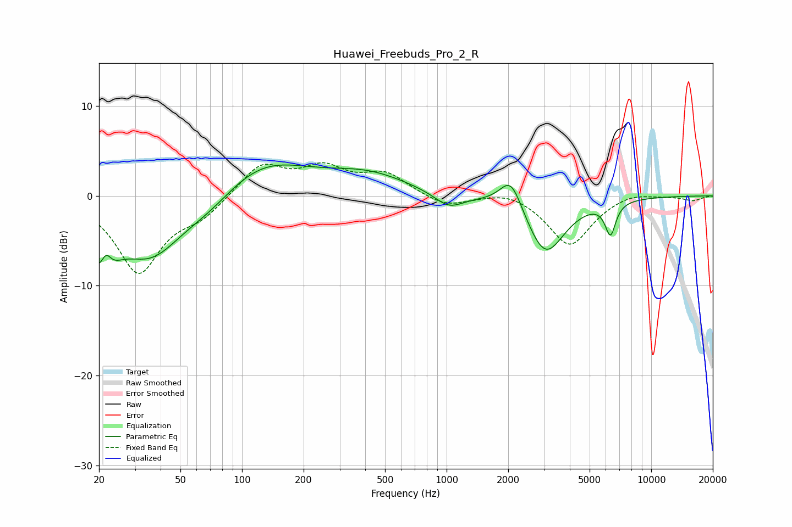

# Huawei_Freebuds_Pro_2_R
See [usage instructions](https://github.com/jaakkopasanen/AutoEq#usage) for more options and info.

### Parametric EQs
Apply preamp of -3.5 dB when using parametric equalizer.

|   # | Type    |   Fc (Hz) |    Q |   Gain (dB) |
|-----|---------|-----------|------|-------------|
|   1 | Peaking |        21 | 2.41 |        -7.3 |
|   2 | Peaking |        22 | 5.01 |         3.6 |
|   3 | Peaking |        36 | 0.88 |        -6.4 |
|   4 | Peaking |        70 | 1.03 |        -1.8 |
|   5 | Peaking |       124 | 0.62 |         4.1 |
|   6 | Peaking |       414 | 0.71 |         2.1 |
|   7 | Peaking |      1025 | 1.99 |        -1.6 |
|   8 | Peaking |      2064 | 2.6  |         3.7 |
|   9 | Peaking |      3040 | 1.5  |        -6.6 |
|  10 | Peaking |      6320 | 5.34 |        -3.6 |

### Fixed Band EQs
When using fixed band (also called graphic) equalizer, apply preamp of **-3.8 dB** (if available) and set gains manually with these parameters.

|   # | Type    |   Fc (Hz) |    Q |   Gain (dB) |
|-----|---------|-----------|------|-------------|
|   1 | Peaking |        31 | 1.41 |        -8.4 |
|   2 | Peaking |        62 | 1.41 |        -1.9 |
|   3 | Peaking |       125 | 1.41 |         3.5 |
|   4 | Peaking |       250 | 1.41 |         2.8 |
|   5 | Peaking |       500 | 1.41 |         2.3 |
|   6 | Peaking |      1000 | 1.41 |        -1.3 |
|   7 | Peaking |      2000 | 1.41 |         0.8 |
|   8 | Peaking |      4000 | 1.41 |        -5.6 |
|   9 | Peaking |      8000 | 1.41 |         0.6 |
|  10 | Peaking |     16000 | 1.41 |        -0.5 |

### Graphs

