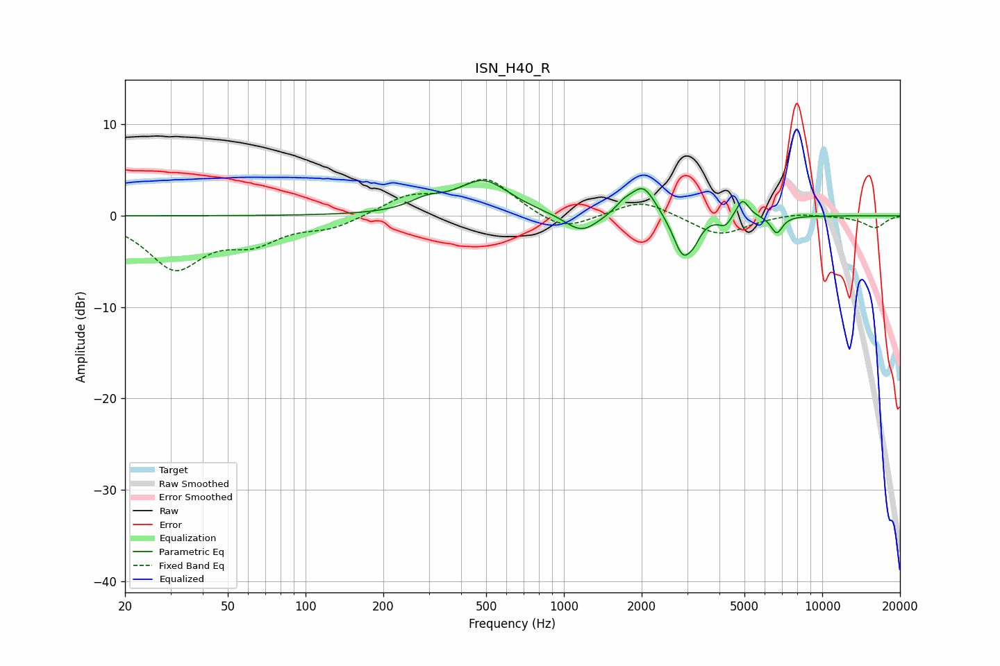

# ISN_H40_R
See [usage instructions](https://github.com/jaakkopasanen/AutoEq#usage) for more options and info.

### Parametric EQs
Apply preamp of -3.9 dB when using parametric equalizer.

|   # | Type    |   Fc (Hz) |    Q |   Gain (dB) |
|-----|---------|-----------|------|-------------|
|   1 | Peaking |       294 | 2.09 |         1.1 |
|   2 | Peaking |       489 | 1.4  |         3.7 |
|   3 | Peaking |      1169 | 2.17 |        -2.1 |
|   4 | Peaking |      1704 | 4.21 |         0.9 |
|   5 | Peaking |      2029 | 2.89 |         3.4 |
|   6 | Peaking |      2891 | 3.73 |        -4.5 |
|   7 | Peaking |      3198 | 6    |        -1   |
|   8 | Peaking |      4214 | 6    |        -1   |
|   9 | Peaking |      4910 | 5.73 |         2.1 |
|  10 | Peaking |      6663 | 6    |        -1.9 |

### Fixed Band EQs
When using fixed band (also called graphic) equalizer, apply preamp of **-4.1 dB** (if available) and set gains manually with these parameters.

|   # | Type    |   Fc (Hz) |    Q |   Gain (dB) |
|-----|---------|-----------|------|-------------|
|   1 | Peaking |        31 | 1.41 |        -5.5 |
|   2 | Peaking |        62 | 1.41 |        -2.5 |
|   3 | Peaking |       125 | 1.41 |        -1.2 |
|   4 | Peaking |       250 | 1.41 |         1.9 |
|   5 | Peaking |       500 | 1.41 |         4   |
|   6 | Peaking |      1000 | 1.41 |        -1.9 |
|   7 | Peaking |      2000 | 1.41 |         1.8 |
|   8 | Peaking |      4000 | 1.41 |        -2.2 |
|   9 | Peaking |      8000 | 1.41 |         0.4 |
|  10 | Peaking |     16000 | 1.41 |        -1.3 |

### Graphs

