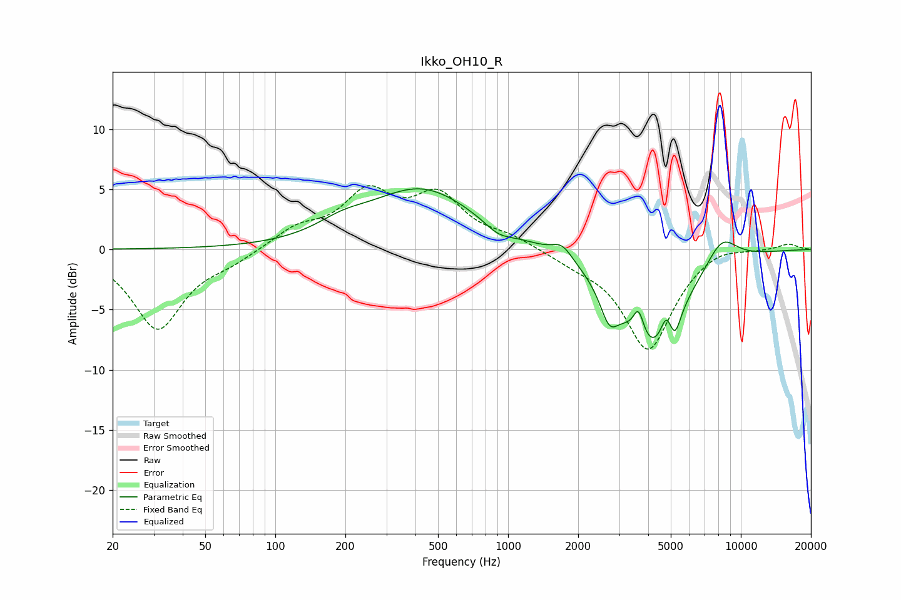

# Ikko_OH10_R
See [usage instructions](https://github.com/jaakkopasanen/AutoEq#usage) for more options and info.

### Parametric EQs
Apply preamp of -5.1 dB when using parametric equalizer.

|   # | Type    |   Fc (Hz) |    Q |   Gain (dB) |
|-----|---------|-----------|------|-------------|
|   1 | Peaking |       193 | 1.32 |         1   |
|   2 | Peaking |       427 | 0.61 |         5   |
|   3 | Peaking |       910 | 2.39 |        -0.8 |
|   4 | Peaking |      1708 | 3.24 |         1.2 |
|   5 | Peaking |      2720 | 3.57 |        -2.7 |
|   6 | Peaking |      3636 | 6    |         2.4 |
|   7 | Peaking |      4141 | 1.08 |        -8.3 |
|   8 | Peaking |      4775 | 6    |         1.8 |
|   9 | Peaking |      5218 | 6    |        -1.7 |
|  10 | Peaking |      8268 | 1.92 |         2.4 |

### Fixed Band EQs
When using fixed band (also called graphic) equalizer, apply preamp of **-5.4 dB** (if available) and set gains manually with these parameters.

|   # | Type    |   Fc (Hz) |    Q |   Gain (dB) |
|-----|---------|-----------|------|-------------|
|   1 | Peaking |        31 | 1.41 |        -6.6 |
|   2 | Peaking |        62 | 1.41 |        -0.8 |
|   3 | Peaking |       125 | 1.41 |         1.6 |
|   4 | Peaking |       250 | 1.41 |         4.3 |
|   5 | Peaking |       500 | 1.41 |         4.1 |
|   6 | Peaking |      1000 | 1.41 |         0.9 |
|   7 | Peaking |      2000 | 1.41 |        -0.8 |
|   8 | Peaking |      4000 | 1.41 |        -8.3 |
|   9 | Peaking |      8000 | 1.41 |         0.6 |
|  10 | Peaking |     16000 | 1.41 |         0.5 |

### Graphs

