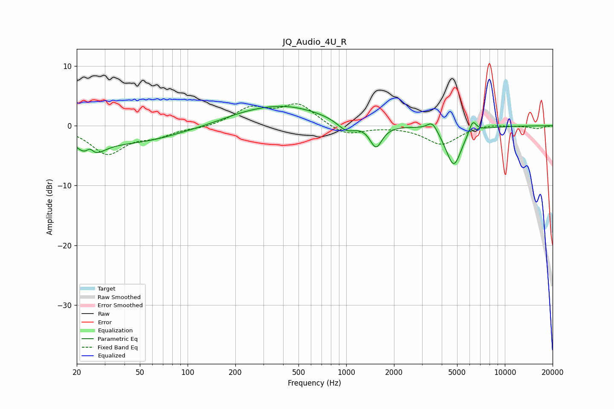

# JQ_Audio_4U_R
See [usage instructions](https://github.com/jaakkopasanen/AutoEq#usage) for more options and info.

### Parametric EQs
Apply preamp of -3.3 dB when using parametric equalizer.

|   # | Type    |   Fc (Hz) |    Q |   Gain (dB) |
|-----|---------|-----------|------|-------------|
|   1 | Peaking |        24 | 1.8  |        -3.9 |
|   2 | Peaking |        24 | 5.95 |         1.5 |
|   3 | Peaking |        47 | 0.52 |        -2.5 |
|   4 | Peaking |       218 | 0.98 |         0.5 |
|   5 | Peaking |       402 | 0.56 |         3.3 |
|   6 | Peaking |      1003 | 2.49 |        -1.8 |
|   7 | Peaking |      1541 | 3.66 |        -3.8 |
|   8 | Peaking |      3489 | 4.27 |         1.7 |
|   9 | Peaking |      4761 | 2.78 |        -6.7 |
|  10 | Peaking |      6271 | 5.93 |         2.2 |

### Fixed Band EQs
When using fixed band (also called graphic) equalizer, apply preamp of **-3.8 dB** (if available) and set gains manually with these parameters.

|   # | Type    |   Fc (Hz) |    Q |   Gain (dB) |
|-----|---------|-----------|------|-------------|
|   1 | Peaking |        31 | 1.41 |        -4.6 |
|   2 | Peaking |        62 | 1.41 |        -1.5 |
|   3 | Peaking |       125 | 1.41 |        -0.4 |
|   4 | Peaking |       250 | 1.41 |         2.8 |
|   5 | Peaking |       500 | 1.41 |         3.5 |
|   6 | Peaking |      1000 | 1.41 |        -1.7 |
|   7 | Peaking |      2000 | 1.41 |        -0   |
|   8 | Peaking |      4000 | 1.41 |        -3.1 |
|   9 | Peaking |      8000 | 1.41 |         0.4 |
|  10 | Peaking |     16000 | 1.41 |        -0.5 |

### Graphs

