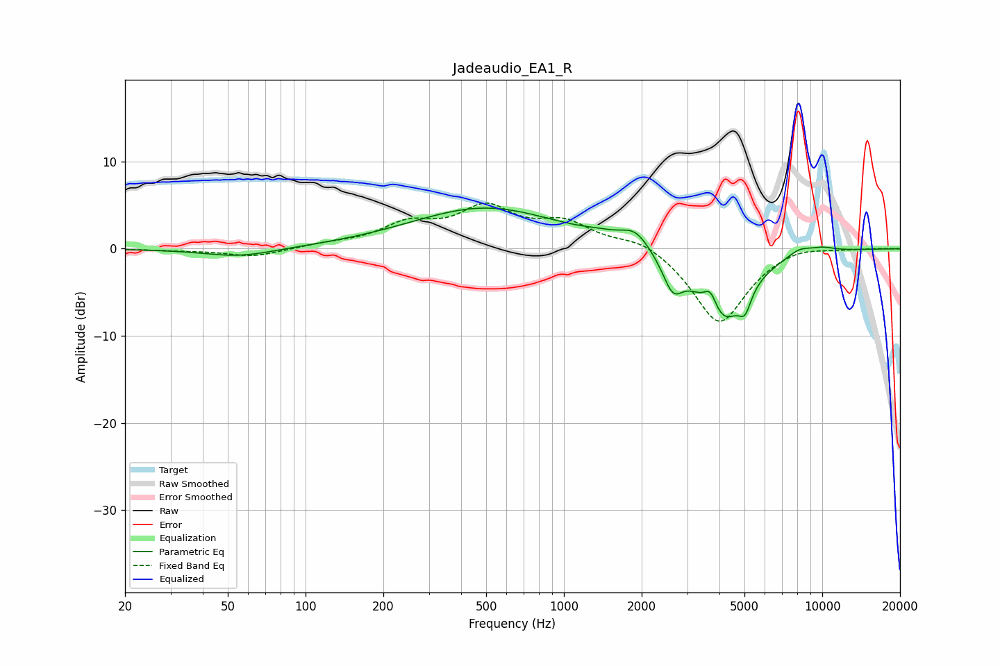

# Jadeaudio_EA1_R
See [usage instructions](https://github.com/jaakkopasanen/AutoEq#usage) for more options and info.

### Parametric EQs
Apply preamp of -4.8 dB when using parametric equalizer.

|   # | Type    |   Fc (Hz) |    Q |   Gain (dB) |
|-----|---------|-----------|------|-------------|
|   1 | Peaking |        55 | 1.02 |        -1   |
|   2 | Peaking |       497 | 0.49 |         4.7 |
|   3 | Peaking |      1405 | 1.79 |         0.5 |
|   4 | Peaking |      1891 | 2.55 |         2   |
|   5 | Peaking |      2639 | 3.68 |        -3.5 |
|   6 | Peaking |      3695 | 5.42 |         2.5 |
|   7 | Peaking |      4086 | 1.49 |        -8.4 |
|   8 | Peaking |      5024 | 5.99 |        -2.3 |
|   9 | Peaking |      8156 | 2.79 |         0.9 |
|  10 | Peaking |     10000 | 2.33 |         0.5 |

### Fixed Band EQs
When using fixed band (also called graphic) equalizer, apply preamp of **-5.3 dB** (if available) and set gains manually with these parameters.

|   # | Type    |   Fc (Hz) |    Q |   Gain (dB) |
|-----|---------|-----------|------|-------------|
|   1 | Peaking |        31 | 1.41 |        -0.2 |
|   2 | Peaking |        62 | 1.41 |        -0.9 |
|   3 | Peaking |       125 | 1.41 |         0.4 |
|   4 | Peaking |       250 | 1.41 |         2.5 |
|   5 | Peaking |       500 | 1.41 |         4.3 |
|   6 | Peaking |      1000 | 1.41 |         2.7 |
|   7 | Peaking |      2000 | 1.41 |         1.4 |
|   8 | Peaking |      4000 | 1.41 |        -8.8 |
|   9 | Peaking |      8000 | 1.41 |         0.7 |
|  10 | Peaking |     16000 | 1.41 |         0.1 |

### Graphs

