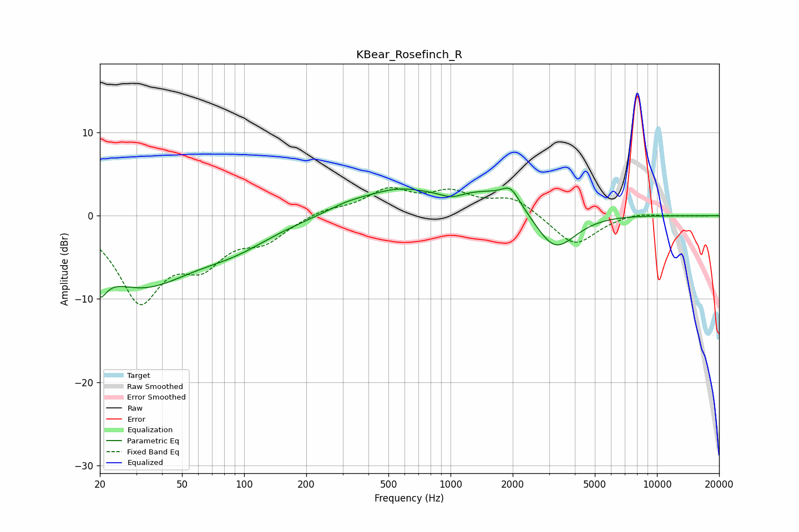

# KBear_Rosefinch_R
See [usage instructions](https://github.com/jaakkopasanen/AutoEq#usage) for more options and info.

### Parametric EQs
Apply preamp of -3.4 dB when using parametric equalizer.

|   # | Type    |   Fc (Hz) |    Q |   Gain (dB) |
|-----|---------|-----------|------|-------------|
|   1 | Peaking |        20 | 5.27 |        -8.6 |
|   2 | Peaking |        20 | 6    |         5.3 |
|   3 | Peaking |        32 | 0.54 |        -8   |
|   4 | Peaking |        91 | 0.78 |        -2.1 |
|   5 | Peaking |       315 | 1.3  |         0.9 |
|   6 | Peaking |       540 | 0.92 |         2.2 |
|   7 | Peaking |      1012 | 2.43 |        -0.8 |
|   8 | Peaking |      1694 | 0.53 |         3.5 |
|   9 | Peaking |      1954 | 3.48 |         1.7 |
|  10 | Peaking |      3184 | 1.31 |        -5.9 |

### Fixed Band EQs
When using fixed band (also called graphic) equalizer, apply preamp of **-3.5 dB** (if available) and set gains manually with these parameters.

|   # | Type    |   Fc (Hz) |    Q |   Gain (dB) |
|-----|---------|-----------|------|-------------|
|   1 | Peaking |        31 | 1.41 |        -9.7 |
|   2 | Peaking |        62 | 1.41 |        -4.6 |
|   3 | Peaking |       125 | 1.41 |        -2.6 |
|   4 | Peaking |       250 | 1.41 |         0.8 |
|   5 | Peaking |       500 | 1.41 |         2.9 |
|   6 | Peaking |      1000 | 1.41 |         2.4 |
|   7 | Peaking |      2000 | 1.41 |         2.1 |
|   8 | Peaking |      4000 | 1.41 |        -3.7 |
|   9 | Peaking |      8000 | 1.41 |         0.5 |
|  10 | Peaking |     16000 | 1.41 |        -0   |

### Graphs

