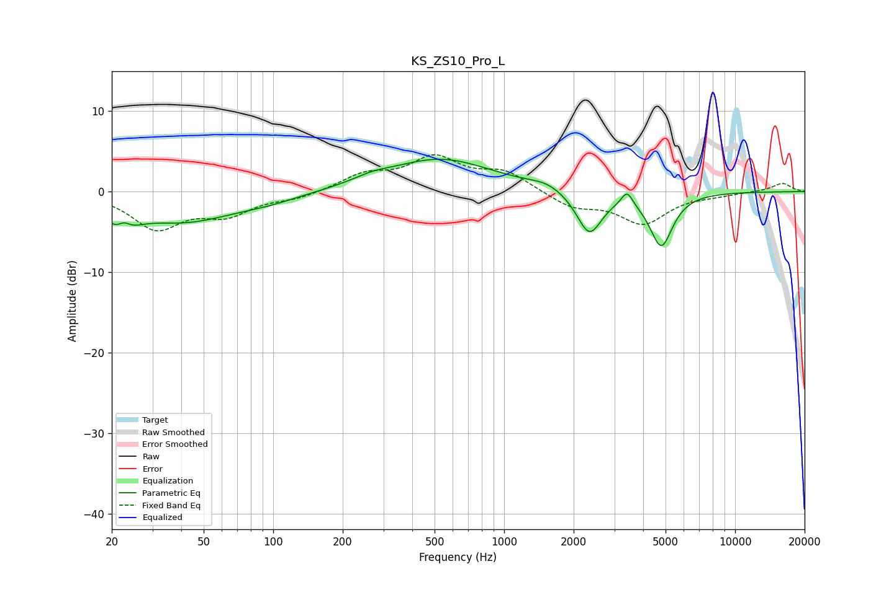

# KS_ZS10_Pro_L
See [usage instructions](https://github.com/jaakkopasanen/AutoEq#usage) for more options and info.

### Parametric EQs
Apply preamp of -4.1 dB when using parametric equalizer.

|   # | Type    |   Fc (Hz) |    Q |   Gain (dB) |
|-----|---------|-----------|------|-------------|
|   1 | Peaking |        22 | 2.5  |        -3.9 |
|   2 | Peaking |        23 | 4.48 |         2.2 |
|   3 | Peaking |        41 | 0.63 |        -3.5 |
|   4 | Peaking |        96 | 1.03 |        -0.7 |
|   5 | Peaking |       267 | 1.82 |         0.6 |
|   6 | Peaking |       528 | 0.62 |         4   |
|   7 | Peaking |      1526 | 1.98 |         0.7 |
|   8 | Peaking |      2338 | 2.57 |        -5.4 |
|   9 | Peaking |      3406 | 5.86 |         1.8 |
|  10 | Peaking |      4790 | 2.82 |        -6.6 |

### Fixed Band EQs
When using fixed band (also called graphic) equalizer, apply preamp of **-4.7 dB** (if available) and set gains manually with these parameters.

|   # | Type    |   Fc (Hz) |    Q |   Gain (dB) |
|-----|---------|-----------|------|-------------|
|   1 | Peaking |        31 | 1.41 |        -4.4 |
|   2 | Peaking |        62 | 1.41 |        -2.5 |
|   3 | Peaking |       125 | 1.41 |        -0.8 |
|   4 | Peaking |       250 | 1.41 |         2   |
|   5 | Peaking |       500 | 1.41 |         3.9 |
|   6 | Peaking |      1000 | 1.41 |         2.3 |
|   7 | Peaking |      2000 | 1.41 |        -1.9 |
|   8 | Peaking |      4000 | 1.41 |        -3.8 |
|   9 | Peaking |      8000 | 1.41 |        -0.3 |
|  10 | Peaking |     16000 | 1.41 |         1.1 |

### Graphs

