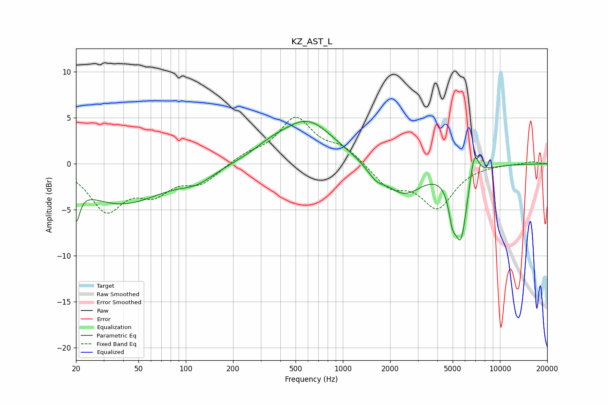

# KZ_AST_L
See [usage instructions](https://github.com/jaakkopasanen/AutoEq#usage) for more options and info.

### Parametric EQs
Apply preamp of -4.7 dB when using parametric equalizer.

|   # | Type    |   Fc (Hz) |    Q |   Gain (dB) |
|-----|---------|-----------|------|-------------|
|   1 | Peaking |        20 | 5.98 |        -3.6 |
|   2 | Peaking |        39 | 0.52 |        -4.3 |
|   3 | Peaking |       118 | 1.34 |        -1.2 |
|   4 | Peaking |       342 | 1.32 |         0.8 |
|   5 | Peaking |       595 | 0.83 |         4.6 |
|   6 | Peaking |      1627 | 2.51 |        -1.2 |
|   7 | Peaking |      2448 | 1.21 |        -3.2 |
|   8 | Peaking |      4983 | 5.89 |        -2.8 |
|   9 | Peaking |      5646 | 3.44 |        -7.5 |
|  10 | Peaking |      6867 | 5.13 |         3.2 |

### Fixed Band EQs
When using fixed band (also called graphic) equalizer, apply preamp of **-5.2 dB** (if available) and set gains manually with these parameters.

|   # | Type    |   Fc (Hz) |    Q |   Gain (dB) |
|-----|---------|-----------|------|-------------|
|   1 | Peaking |        31 | 1.41 |        -4.8 |
|   2 | Peaking |        62 | 1.41 |        -2.7 |
|   3 | Peaking |       125 | 1.41 |        -1.9 |
|   4 | Peaking |       250 | 1.41 |         0.9 |
|   5 | Peaking |       500 | 1.41 |         4.8 |
|   6 | Peaking |      1000 | 1.41 |         1.6 |
|   7 | Peaking |      2000 | 1.41 |        -2.4 |
|   8 | Peaking |      4000 | 1.41 |        -4.6 |
|   9 | Peaking |      8000 | 1.41 |        -0   |
|  10 | Peaking |     16000 | 1.41 |         0.3 |

### Graphs

