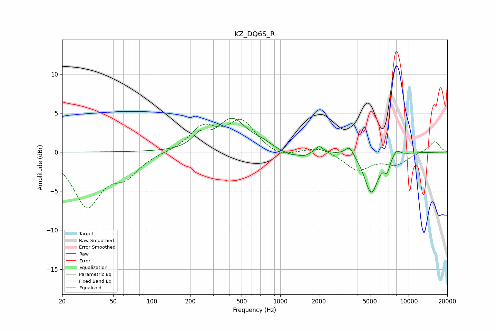

# KZ_DQ6S_R
See [usage instructions](https://github.com/jaakkopasanen/AutoEq#usage) for more options and info.

### Parametric EQs
Apply preamp of -4.4 dB when using parametric equalizer.

|   # | Type    |   Fc (Hz) |    Q |   Gain (dB) |
|-----|---------|-----------|------|-------------|
|   1 | Peaking |       237 | 2.43 |         1.5 |
|   2 | Peaking |       422 | 1.29 |         4.1 |
|   3 | Peaking |       719 | 1.79 |         0.7 |
|   4 | Peaking |      1215 | 1.58 |        -0.7 |
|   5 | Peaking |      1541 | 4.08 |        -0.3 |
|   6 | Peaking |      2010 | 4.84 |         0.9 |
|   7 | Peaking |      3465 | 4.15 |         1.3 |
|   8 | Peaking |      5116 | 2.61 |        -5.2 |
|   9 | Peaking |      6791 | 6    |        -1.6 |
|  10 | Peaking |      8041 | 4.35 |         0.8 |

### Fixed Band EQs
When using fixed band (also called graphic) equalizer, apply preamp of **-4.3 dB** (if available) and set gains manually with these parameters.

|   # | Type    |   Fc (Hz) |    Q |   Gain (dB) |
|-----|---------|-----------|------|-------------|
|   1 | Peaking |        31 | 1.41 |        -6.7 |
|   2 | Peaking |        62 | 1.41 |        -2.5 |
|   3 | Peaking |       125 | 1.41 |        -0   |
|   4 | Peaking |       250 | 1.41 |         3   |
|   5 | Peaking |       500 | 1.41 |         3.8 |
|   6 | Peaking |      1000 | 1.41 |        -0.8 |
|   7 | Peaking |      2000 | 1.41 |         0.8 |
|   8 | Peaking |      4000 | 1.41 |        -2.3 |
|   9 | Peaking |      8000 | 1.41 |        -1.5 |
|  10 | Peaking |     16000 | 1.41 |         1.4 |

### Graphs

