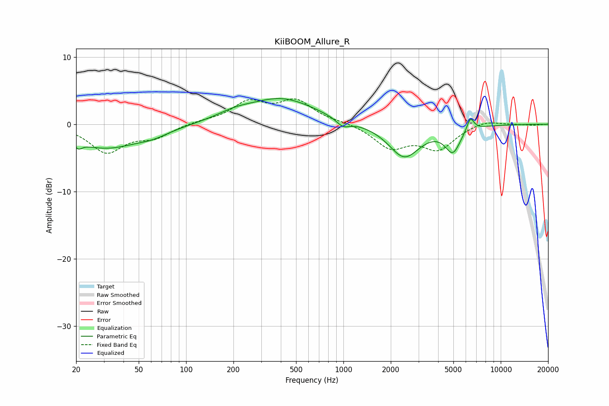

# KiiBOOM_Allure_R
See [usage instructions](https://github.com/jaakkopasanen/AutoEq#usage) for more options and info.

### Parametric EQs
Apply preamp of -3.9 dB when using parametric equalizer.

|   # | Type    |   Fc (Hz) |    Q |   Gain (dB) |
|-----|---------|-----------|------|-------------|
|   1 | Peaking |        21 | 6    |         2.5 |
|   2 | Peaking |        21 | 5.92 |        -3.5 |
|   3 | Peaking |        31 | 0.66 |        -3.4 |
|   4 | Peaking |        62 | 1.37 |        -0.8 |
|   5 | Peaking |       202 | 1.27 |         0.8 |
|   6 | Peaking |       405 | 0.65 |         3.8 |
|   7 | Peaking |       993 | 3.31 |        -1.1 |
|   8 | Peaking |      2436 | 1.42 |        -4.9 |
|   9 | Peaking |      4961 | 2.88 |        -3.6 |
|  10 | Peaking |      6411 | 5.98 |         2   |

### Fixed Band EQs
When using fixed band (also called graphic) equalizer, apply preamp of **-3.9 dB** (if available) and set gains manually with these parameters.

|   # | Type    |   Fc (Hz) |    Q |   Gain (dB) |
|-----|---------|-----------|------|-------------|
|   1 | Peaking |        31 | 1.41 |        -4   |
|   2 | Peaking |        62 | 1.41 |        -1.7 |
|   3 | Peaking |       125 | 1.41 |         0.4 |
|   4 | Peaking |       250 | 1.41 |         3.1 |
|   5 | Peaking |       500 | 1.41 |         3.3 |
|   6 | Peaking |      1000 | 1.41 |         0.3 |
|   7 | Peaking |      2000 | 1.41 |        -3.3 |
|   8 | Peaking |      4000 | 1.41 |        -3.5 |
|   9 | Peaking |      8000 | 1.41 |         0.7 |
|  10 | Peaking |     16000 | 1.41 |        -0.1 |

### Graphs

