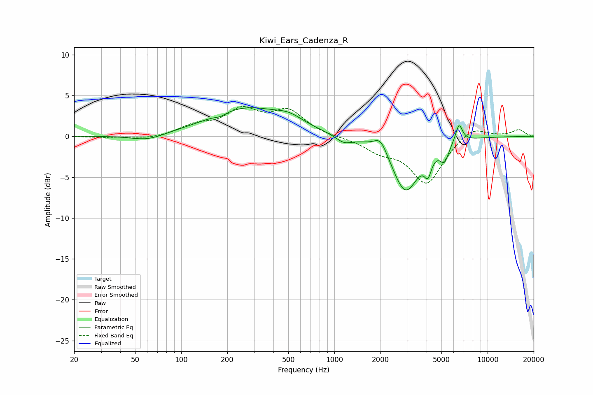

# Kiwi_Ears_Cadenza_R
See [usage instructions](https://github.com/jaakkopasanen/AutoEq#usage) for more options and info.

### Parametric EQs
Apply preamp of -3.6 dB when using parametric equalizer.

|   # | Type    |   Fc (Hz) |    Q |   Gain (dB) |
|-----|---------|-----------|------|-------------|
|   1 | Peaking |        60 | 1.32 |        -0.8 |
|   2 | Peaking |       180 | 3.58 |        -0.4 |
|   3 | Peaking |       263 | 0.58 |         3.4 |
|   4 | Peaking |       508 | 1.52 |         1   |
|   5 | Peaking |      1153 | 2.56 |        -0.9 |
|   6 | Peaking |      2004 | 3.29 |         1.8 |
|   7 | Peaking |      2911 | 1.62 |        -6.7 |
|   8 | Peaking |      4081 | 5.99 |        -2.2 |
|   9 | Peaking |      5224 | 4.89 |        -2   |
|  10 | Peaking |      6507 | 5.97 |         2.3 |

### Fixed Band EQs
When using fixed band (also called graphic) equalizer, apply preamp of **-3.7 dB** (if available) and set gains manually with these parameters.

|   # | Type    |   Fc (Hz) |    Q |   Gain (dB) |
|-----|---------|-----------|------|-------------|
|   1 | Peaking |        31 | 1.41 |        -0.1 |
|   2 | Peaking |        62 | 1.41 |        -0.4 |
|   3 | Peaking |       125 | 1.41 |         1.2 |
|   4 | Peaking |       250 | 1.41 |         2.9 |
|   5 | Peaking |       500 | 1.41 |         2.9 |
|   6 | Peaking |      1000 | 1.41 |        -0.1 |
|   7 | Peaking |      2000 | 1.41 |        -1.5 |
|   8 | Peaking |      4000 | 1.41 |        -5.7 |
|   9 | Peaking |      8000 | 1.41 |         1.4 |
|  10 | Peaking |     16000 | 1.41 |         0.8 |

### Graphs

