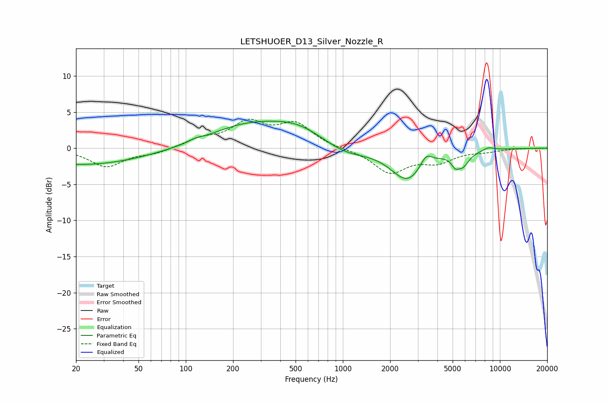

# LETSHUOER_D13_Silver_Nozzle_R
See [usage instructions](https://github.com/jaakkopasanen/AutoEq#usage) for more options and info.

### Parametric EQs
Apply preamp of -3.8 dB when using parametric equalizer.

|   # | Type    |   Fc (Hz) |    Q |   Gain (dB) |
|-----|---------|-----------|------|-------------|
|   1 | Peaking |        23 | 0.36 |        -2.3 |
|   2 | Peaking |       115 | 3.87 |         0.3 |
|   3 | Peaking |       248 | 0.56 |         3   |
|   4 | Peaking |       517 | 0.85 |         2.1 |
|   5 | Peaking |      1038 | 1.07 |        -1.2 |
|   6 | Peaking |      2580 | 1.34 |        -4.4 |
|   7 | Peaking |      3385 | 3.77 |         1.7 |
|   8 | Peaking |      5176 | 6    |        -1.1 |
|   9 | Peaking |      5787 | 3.34 |        -1.9 |
|  10 | Peaking |      8464 | 3.81 |         0.4 |

### Fixed Band EQs
When using fixed band (also called graphic) equalizer, apply preamp of **-4.1 dB** (if available) and set gains manually with these parameters.

|   # | Type    |   Fc (Hz) |    Q |   Gain (dB) |
|-----|---------|-----------|------|-------------|
|   1 | Peaking |        31 | 1.41 |        -2.5 |
|   2 | Peaking |        62 | 1.41 |        -0.7 |
|   3 | Peaking |       125 | 1.41 |         1.1 |
|   4 | Peaking |       250 | 1.41 |         3.3 |
|   5 | Peaking |       500 | 1.41 |         3.2 |
|   6 | Peaking |      1000 | 1.41 |        -0.1 |
|   7 | Peaking |      2000 | 1.41 |        -3.3 |
|   8 | Peaking |      4000 | 1.41 |        -1.7 |
|   9 | Peaking |      8000 | 1.41 |        -0.4 |
|  10 | Peaking |     16000 | 1.41 |         0   |

### Graphs

