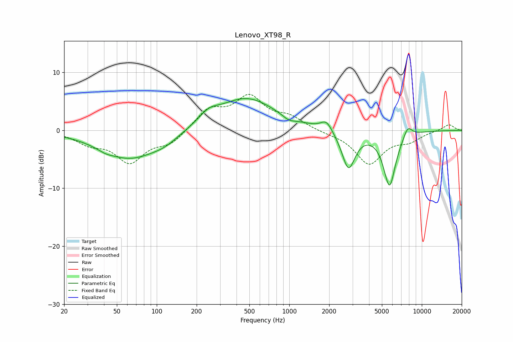

# Lenovo_XT98_R
See [usage instructions](https://github.com/jaakkopasanen/AutoEq#usage) for more options and info.

### Parametric EQs
Apply preamp of -5.6 dB when using parametric equalizer.

|   # | Type    |   Fc (Hz) |    Q |   Gain (dB) |
|-----|---------|-----------|------|-------------|
|   1 | Peaking |        41 | 2.62 |        -0.4 |
|   2 | Peaking |        63 | 0.64 |        -4.9 |
|   3 | Peaking |       115 | 1.49 |        -0.9 |
|   4 | Peaking |       246 | 1.89 |         1.6 |
|   5 | Peaking |       474 | 0.64 |         5.6 |
|   6 | Peaking |       994 | 2.94 |        -0.8 |
|   7 | Peaking |      1908 | 3.31 |         1.8 |
|   8 | Peaking |      2798 | 2.81 |        -6.6 |
|   9 | Peaking |      5709 | 2.97 |        -9.4 |
|  10 | Peaking |      7836 | 4.07 |         2   |

### Fixed Band EQs
When using fixed band (also called graphic) equalizer, apply preamp of **-6.3 dB** (if available) and set gains manually with these parameters.

|   # | Type    |   Fc (Hz) |    Q |   Gain (dB) |
|-----|---------|-----------|------|-------------|
|   1 | Peaking |        31 | 1.41 |        -1.9 |
|   2 | Peaking |        62 | 1.41 |        -5.2 |
|   3 | Peaking |       125 | 1.41 |        -2.1 |
|   4 | Peaking |       250 | 1.41 |         3.4 |
|   5 | Peaking |       500 | 1.41 |         5.4 |
|   6 | Peaking |      1000 | 1.41 |         1.9 |
|   7 | Peaking |      2000 | 1.41 |        -0.3 |
|   8 | Peaking |      4000 | 1.41 |        -5.7 |
|   9 | Peaking |      8000 | 1.41 |        -1.5 |
|  10 | Peaking |     16000 | 1.41 |         1.1 |

### Graphs

