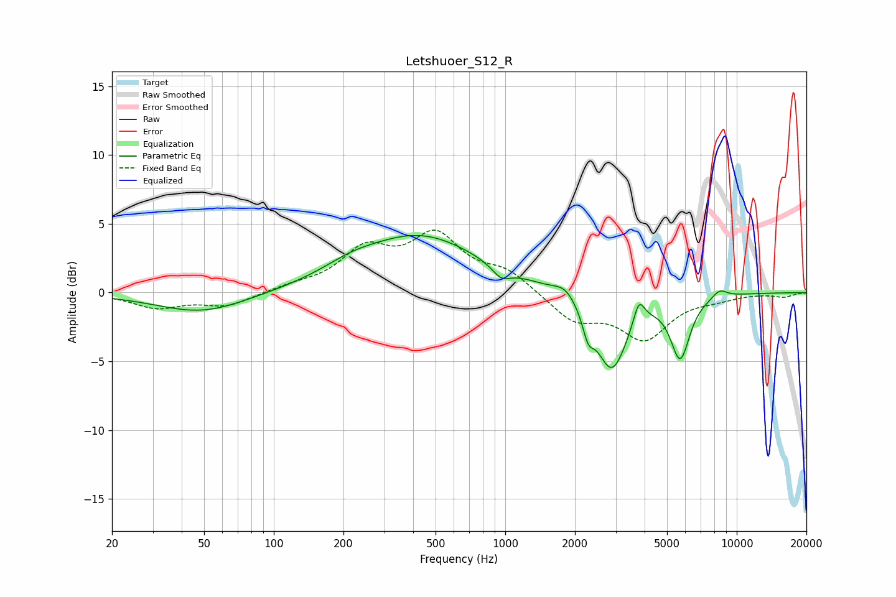

# Letshuoer_S12_R
See [usage instructions](https://github.com/jaakkopasanen/AutoEq#usage) for more options and info.

### Parametric EQs
Apply preamp of -4.2 dB when using parametric equalizer.

|   # | Type    |   Fc (Hz) |    Q |   Gain (dB) |
|-----|---------|-----------|------|-------------|
|   1 | Peaking |        49 | 0.72 |        -1.5 |
|   2 | Peaking |       214 | 1.24 |         0.6 |
|   3 | Peaking |       427 | 0.54 |         4.1 |
|   4 | Peaking |       961 | 3.56 |        -0.9 |
|   5 | Peaking |      1820 | 2.94 |         0.8 |
|   6 | Peaking |      2282 | 6    |        -1.6 |
|   7 | Peaking |      2881 | 2.04 |        -5.6 |
|   8 | Peaking |      3780 | 5.95 |         1.8 |
|   9 | Peaking |      5700 | 3.36 |        -4.5 |
|  10 | Peaking |      8445 | 4.07 |         0.6 |

### Fixed Band EQs
When using fixed band (also called graphic) equalizer, apply preamp of **-4.6 dB** (if available) and set gains manually with these parameters.

|   # | Type    |   Fc (Hz) |    Q |   Gain (dB) |
|-----|---------|-----------|------|-------------|
|   1 | Peaking |        31 | 1.41 |        -1.1 |
|   2 | Peaking |        62 | 1.41 |        -1   |
|   3 | Peaking |       125 | 1.41 |         0.4 |
|   4 | Peaking |       250 | 1.41 |         2.9 |
|   5 | Peaking |       500 | 1.41 |         3.8 |
|   6 | Peaking |      1000 | 1.41 |         1.4 |
|   7 | Peaking |      2000 | 1.41 |        -2   |
|   8 | Peaking |      4000 | 1.41 |        -3.2 |
|   9 | Peaking |      8000 | 1.41 |        -0.3 |
|  10 | Peaking |     16000 | 1.41 |        -0.3 |

### Graphs

