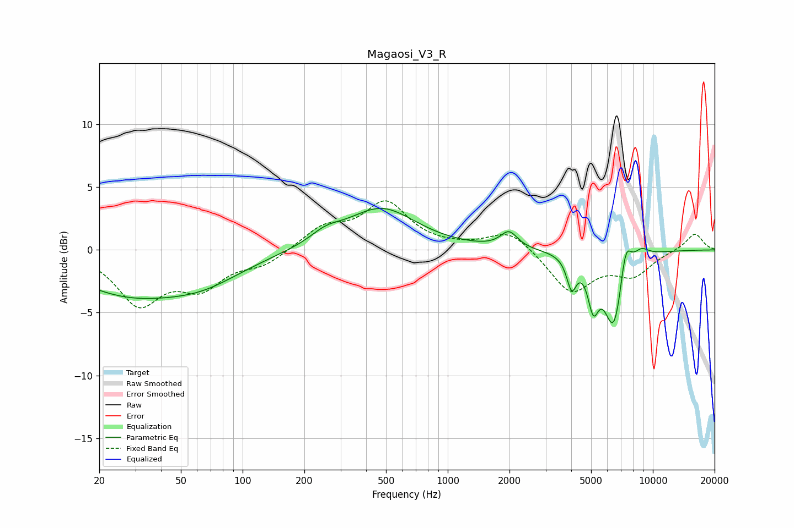

# Magaosi_V3_R
See [usage instructions](https://github.com/jaakkopasanen/AutoEq#usage) for more options and info.

### Parametric EQs
Apply preamp of -3.4 dB when using parametric equalizer.

|   # | Type    |   Fc (Hz) |    Q |   Gain (dB) |
|-----|---------|-----------|------|-------------|
|   1 | Peaking |        27 | 0.51 |        -3.2 |
|   2 | Peaking |        64 | 0.7  |        -1.8 |
|   3 | Peaking |       254 | 1.85 |         0.8 |
|   4 | Peaking |       474 | 0.84 |         3.3 |
|   5 | Peaking |      1989 | 3.46 |         1.3 |
|   6 | Peaking |      4019 | 6    |        -2.4 |
|   7 | Peaking |      5121 | 5.26 |        -3.3 |
|   8 | Peaking |      6473 | 2.79 |        -6.4 |
|   9 | Peaking |      7353 | 4.76 |         3.1 |
|  10 | Peaking |      8766 | 3.38 |         0.8 |

### Fixed Band EQs
When using fixed band (also called graphic) equalizer, apply preamp of **-4.0 dB** (if available) and set gains manually with these parameters.

|   # | Type    |   Fc (Hz) |    Q |   Gain (dB) |
|-----|---------|-----------|------|-------------|
|   1 | Peaking |        31 | 1.41 |        -4.1 |
|   2 | Peaking |        62 | 1.41 |        -2.6 |
|   3 | Peaking |       125 | 1.41 |        -1.1 |
|   4 | Peaking |       250 | 1.41 |         1.7 |
|   5 | Peaking |       500 | 1.41 |         3.6 |
|   6 | Peaking |      1000 | 1.41 |         0.1 |
|   7 | Peaking |      2000 | 1.41 |         1.6 |
|   8 | Peaking |      4000 | 1.41 |        -3.4 |
|   9 | Peaking |      8000 | 1.41 |        -1.9 |
|  10 | Peaking |     16000 | 1.41 |         1.4 |

### Graphs

