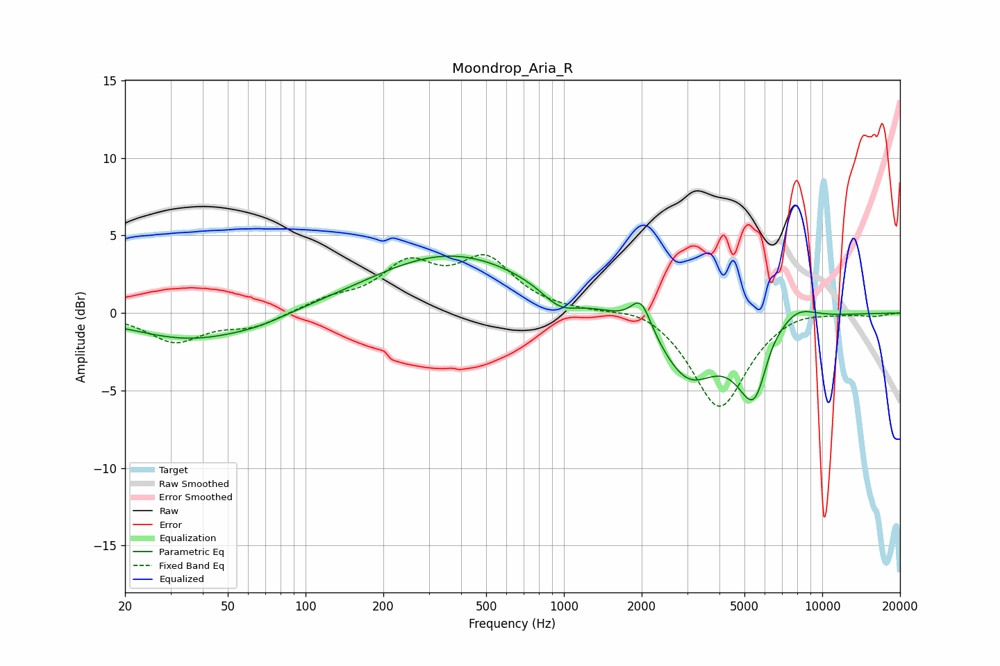

# Moondrop_Aria_R
See [usage instructions](https://github.com/jaakkopasanen/AutoEq#usage) for more options and info.

### Parametric EQs
Apply preamp of -3.8 dB when using parametric equalizer.

|   # | Type    |   Fc (Hz) |    Q |   Gain (dB) |
|-----|---------|-----------|------|-------------|
|   1 | Peaking |        36 | 0.63 |        -1.7 |
|   2 | Peaking |        66 | 1.21 |        -0.4 |
|   3 | Peaking |       316 | 0.67 |         0.2 |
|   4 | Peaking |       375 | 0.44 |         3.6 |
|   5 | Peaking |       964 | 1.96 |        -1.2 |
|   6 | Peaking |      1989 | 3.55 |         2.1 |
|   7 | Peaking |      3025 | 1.25 |        -4   |
|   8 | Peaking |      5563 | 2    |        -7.2 |
|   9 | Peaking |      6059 | 2.21 |         2.9 |
|  10 | Peaking |      7911 | 1.72 |         1.2 |

### Fixed Band EQs
When using fixed band (also called graphic) equalizer, apply preamp of **-3.9 dB** (if available) and set gains manually with these parameters.

|   # | Type    |   Fc (Hz) |    Q |   Gain (dB) |
|-----|---------|-----------|------|-------------|
|   1 | Peaking |        31 | 1.41 |        -1.8 |
|   2 | Peaking |        62 | 1.41 |        -0.9 |
|   3 | Peaking |       125 | 1.41 |         0.7 |
|   4 | Peaking |       250 | 1.41 |         2.9 |
|   5 | Peaking |       500 | 1.41 |         3.2 |
|   6 | Peaking |      1000 | 1.41 |         0   |
|   7 | Peaking |      2000 | 1.41 |         0.6 |
|   8 | Peaking |      4000 | 1.41 |        -6.2 |
|   9 | Peaking |      8000 | 1.41 |         0.4 |
|  10 | Peaking |     16000 | 1.41 |        -0.2 |

### Graphs

