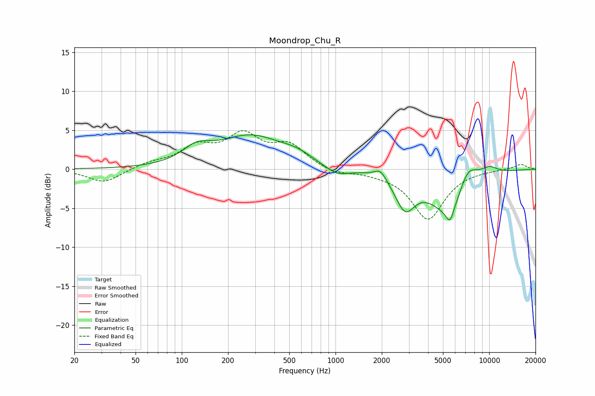

# Moondrop_Chu_R
See [usage instructions](https://github.com/jaakkopasanen/AutoEq#usage) for more options and info.

### Parametric EQs
Apply preamp of -4.5 dB when using parametric equalizer.

|   # | Type    |   Fc (Hz) |    Q |   Gain (dB) |
|-----|---------|-----------|------|-------------|
|   1 | Peaking |       125 | 1.55 |         1.8 |
|   2 | Peaking |       282 | 0.66 |         4.1 |
|   3 | Peaking |       561 | 1.44 |         0.9 |
|   4 | Peaking |      1017 | 1.81 |        -1.1 |
|   5 | Peaking |      1957 | 3.67 |         1.3 |
|   6 | Peaking |      2831 | 2.22 |        -4.2 |
|   7 | Peaking |      5549 | 5.98 |        -1.6 |
|   8 | Peaking |      5673 | 1.07 |        -6.3 |
|   9 | Peaking |      7203 | 1.93 |         3.9 |
|  10 | Peaking |     10000 | 2.05 |         1.1 |

### Fixed Band EQs
When using fixed band (also called graphic) equalizer, apply preamp of **-5.0 dB** (if available) and set gains manually with these parameters.

|   # | Type    |   Fc (Hz) |    Q |   Gain (dB) |
|-----|---------|-----------|------|-------------|
|   1 | Peaking |        31 | 1.41 |        -1.8 |
|   2 | Peaking |        62 | 1.41 |         0.7 |
|   3 | Peaking |       125 | 1.41 |         2.6 |
|   4 | Peaking |       250 | 1.41 |         4   |
|   5 | Peaking |       500 | 1.41 |         2.8 |
|   6 | Peaking |      1000 | 1.41 |        -0.7 |
|   7 | Peaking |      2000 | 1.41 |        -0.3 |
|   8 | Peaking |      4000 | 1.41 |        -6.4 |
|   9 | Peaking |      8000 | 1.41 |        -0.1 |
|  10 | Peaking |     16000 | 1.41 |         0.7 |

### Graphs

