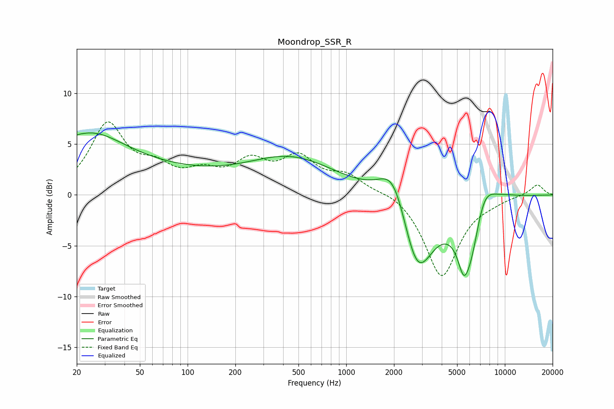

# Moondrop_SSR_R
See [usage instructions](https://github.com/jaakkopasanen/AutoEq#usage) for more options and info.

### Parametric EQs
Apply preamp of -6.2 dB when using parametric equalizer.

|   # | Type    |   Fc (Hz) |    Q |   Gain (dB) |
|-----|---------|-----------|------|-------------|
|   1 | Peaking |        20 | 5.82 |         0.1 |
|   2 | Peaking |        23 | 0.61 |         4.9 |
|   3 | Peaking |        64 | 0.35 |         1.8 |
|   4 | Peaking |       451 | 0.49 |         3.5 |
|   5 | Peaking |      2002 | 1.53 |         4.7 |
|   6 | Peaking |      2792 | 1.36 |        -8.4 |
|   7 | Peaking |      5492 | 4.15 |        -2.4 |
|   8 | Peaking |      6125 | 1.68 |        -7.8 |
|   9 | Peaking |      7174 | 1.72 |         4.9 |
|  10 | Peaking |     10000 | 1.32 |         0.3 |

### Fixed Band EQs
When using fixed band (also called graphic) equalizer, apply preamp of **-7.3 dB** (if available) and set gains manually with these parameters.

|   # | Type    |   Fc (Hz) |    Q |   Gain (dB) |
|-----|---------|-----------|------|-------------|
|   1 | Peaking |        31 | 1.41 |         6.7 |
|   2 | Peaking |        62 | 1.41 |         2.1 |
|   3 | Peaking |       125 | 1.41 |         1.7 |
|   4 | Peaking |       250 | 1.41 |         2.8 |
|   5 | Peaking |       500 | 1.41 |         3.3 |
|   6 | Peaking |      1000 | 1.41 |         1.7 |
|   7 | Peaking |      2000 | 1.41 |         0.5 |
|   8 | Peaking |      4000 | 1.41 |        -8.1 |
|   9 | Peaking |      8000 | 1.41 |        -0.4 |
|  10 | Peaking |     16000 | 1.41 |         1.1 |

### Graphs

