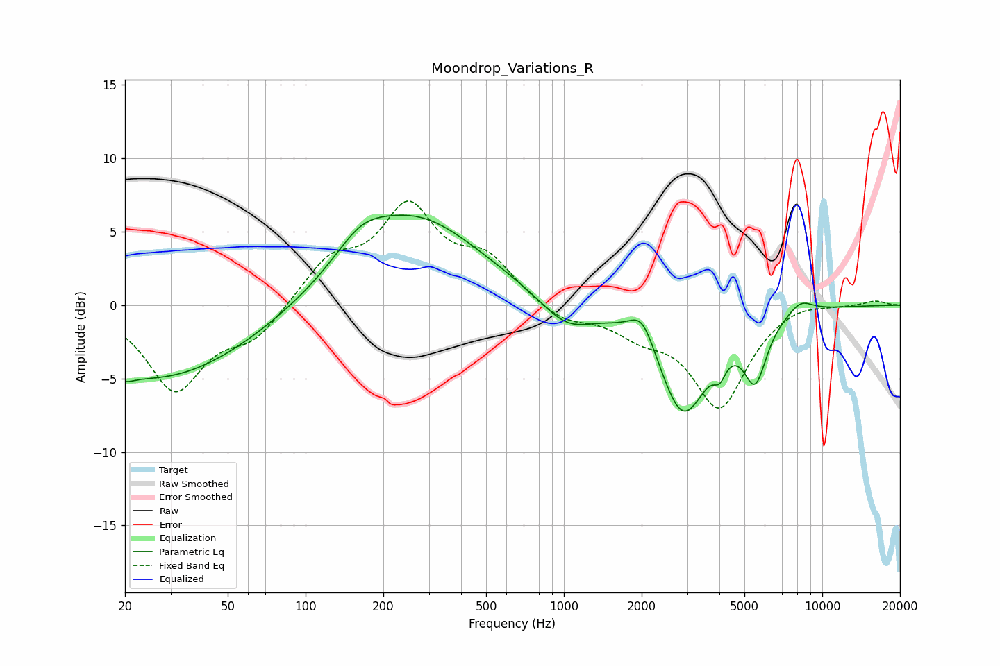

# Moondrop_Variations_R
See [usage instructions](https://github.com/jaakkopasanen/AutoEq#usage) for more options and info.

### Parametric EQs
Apply preamp of -6.2 dB when using parametric equalizer.

|   # | Type    |   Fc (Hz) |    Q |   Gain (dB) |
|-----|---------|-----------|------|-------------|
|   1 | Peaking |        20 | 4.14 |        -0.5 |
|   2 | Peaking |        27 | 0.39 |        -5.1 |
|   3 | Peaking |       163 | 1.45 |         1.7 |
|   4 | Peaking |       264 | 0.55 |         6   |
|   5 | Peaking |      1023 | 1.37 |        -1.9 |
|   6 | Peaking |      2012 | 2.85 |         2.1 |
|   7 | Peaking |      2891 | 1.47 |        -7.3 |
|   8 | Peaking |      4009 | 6    |        -1.2 |
|   9 | Peaking |      5506 | 3.15 |        -4.1 |
|  10 | Peaking |      8241 | 2.67 |         0.9 |

### Fixed Band EQs
When using fixed band (also called graphic) equalizer, apply preamp of **-7.2 dB** (if available) and set gains manually with these parameters.

|   # | Type    |   Fc (Hz) |    Q |   Gain (dB) |
|-----|---------|-----------|------|-------------|
|   1 | Peaking |        31 | 1.41 |        -5.7 |
|   2 | Peaking |        62 | 1.41 |        -2.1 |
|   3 | Peaking |       125 | 1.41 |         2.8 |
|   4 | Peaking |       250 | 1.41 |         6.2 |
|   5 | Peaking |       500 | 1.41 |         2.8 |
|   6 | Peaking |      1000 | 1.41 |        -1.1 |
|   7 | Peaking |      2000 | 1.41 |        -1.5 |
|   8 | Peaking |      4000 | 1.41 |        -6.8 |
|   9 | Peaking |      8000 | 1.41 |         0.5 |
|  10 | Peaking |     16000 | 1.41 |         0.3 |

### Graphs

