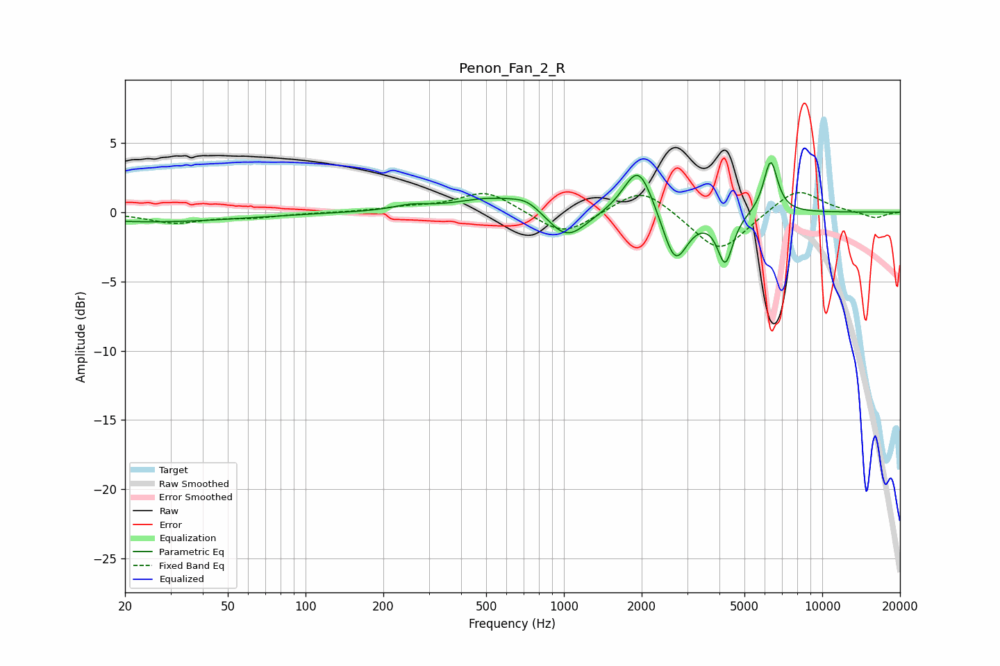

# Penon_Fan_2_R
See [usage instructions](https://github.com/jaakkopasanen/AutoEq#usage) for more options and info.

### Parametric EQs
Apply preamp of -3.7 dB when using parametric equalizer.

|   # | Type    |   Fc (Hz) |    Q |   Gain (dB) |
|-----|---------|-----------|------|-------------|
|   1 | Peaking |        21 | 4.6  |         0   |
|   2 | Peaking |        25 | 0.41 |        -0.7 |
|   3 | Peaking |       256 | 2.07 |         0.4 |
|   4 | Peaking |       525 | 1.03 |         1   |
|   5 | Peaking |       722 | 2.41 |         0.7 |
|   6 | Peaking |      1027 | 1.83 |        -2.2 |
|   7 | Peaking |      1944 | 2.48 |         3.7 |
|   8 | Peaking |      2694 | 2.93 |        -3.9 |
|   9 | Peaking |      4212 | 4.7  |        -3.5 |
|  10 | Peaking |      6312 | 5.07 |         3.8 |

### Fixed Band EQs
When using fixed band (also called graphic) equalizer, apply preamp of **-1.5 dB** (if available) and set gains manually with these parameters.

|   # | Type    |   Fc (Hz) |    Q |   Gain (dB) |
|-----|---------|-----------|------|-------------|
|   1 | Peaking |        31 | 1.41 |        -0.7 |
|   2 | Peaking |        62 | 1.41 |        -0.3 |
|   3 | Peaking |       125 | 1.41 |        -0   |
|   4 | Peaking |       250 | 1.41 |         0.3 |
|   5 | Peaking |       500 | 1.41 |         1.5 |
|   6 | Peaking |      1000 | 1.41 |        -1.8 |
|   7 | Peaking |      2000 | 1.41 |         1.9 |
|   8 | Peaking |      4000 | 1.41 |        -3   |
|   9 | Peaking |      8000 | 1.41 |         1.8 |
|  10 | Peaking |     16000 | 1.41 |        -0.5 |

### Graphs

