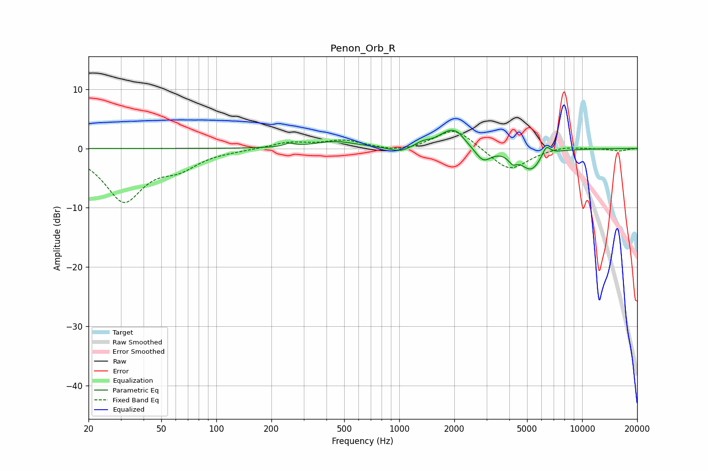

# Penon_Orb_R
See [usage instructions](https://github.com/jaakkopasanen/AutoEq#usage) for more options and info.

### Parametric EQs
Apply preamp of -3.2 dB when using parametric equalizer.

|   # | Type    |   Fc (Hz) |    Q |   Gain (dB) |
|-----|---------|-----------|------|-------------|
|   1 | Peaking |       250 | 4.94 |         0.5 |
|   2 | Peaking |       445 | 1.26 |         1.2 |
|   3 | Peaking |      1007 | 2.54 |        -0.9 |
|   4 | Peaking |      1339 | 3.55 |         0.6 |
|   5 | Peaking |      1922 | 2.01 |         3.1 |
|   6 | Peaking |      2086 | 4.15 |         0.5 |
|   7 | Peaking |      2873 | 3.17 |        -2.4 |
|   8 | Peaking |      4167 | 6    |        -1.3 |
|   9 | Peaking |      5262 | 2.44 |        -3.6 |
|  10 | Peaking |      6362 | 5.99 |         1.8 |

### Fixed Band EQs
When using fixed band (also called graphic) equalizer, apply preamp of **-3.0 dB** (if available) and set gains manually with these parameters.

|   # | Type    |   Fc (Hz) |    Q |   Gain (dB) |
|-----|---------|-----------|------|-------------|
|   1 | Peaking |        31 | 1.41 |        -8.6 |
|   2 | Peaking |        62 | 1.41 |        -2.6 |
|   3 | Peaking |       125 | 1.41 |        -0.2 |
|   4 | Peaking |       250 | 1.41 |         1   |
|   5 | Peaking |       500 | 1.41 |         1.3 |
|   6 | Peaking |      1000 | 1.41 |        -0.7 |
|   7 | Peaking |      2000 | 1.41 |         3.6 |
|   8 | Peaking |      4000 | 1.41 |        -3.9 |
|   9 | Peaking |      8000 | 1.41 |         0.5 |
|  10 | Peaking |     16000 | 1.41 |        -0.4 |

### Graphs

