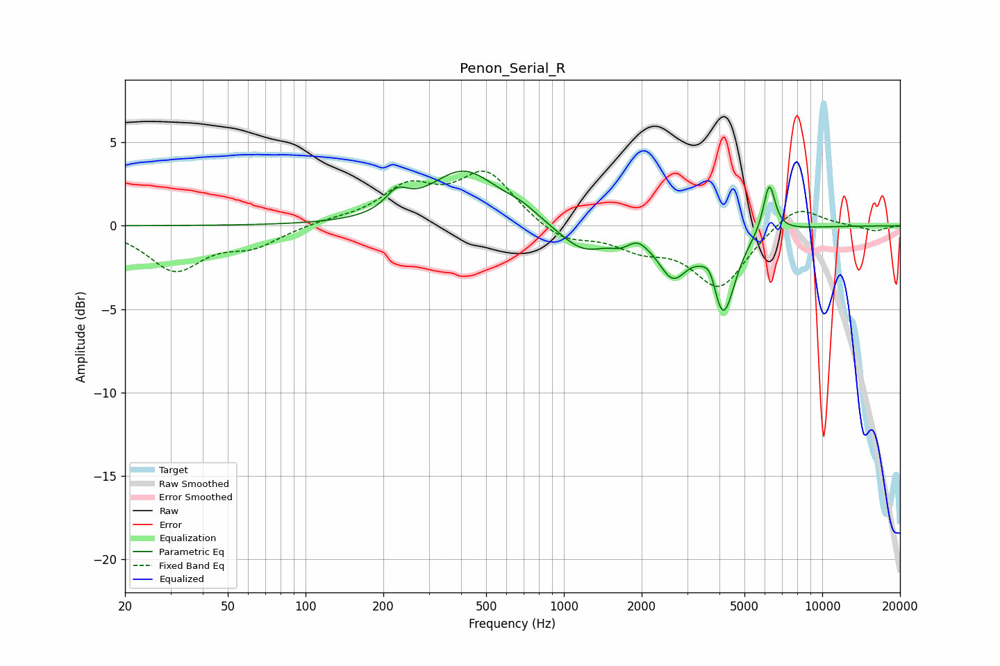

# Penon_Serial_R
See [usage instructions](https://github.com/jaakkopasanen/AutoEq#usage) for more options and info.

### Parametric EQs
Apply preamp of -3.4 dB when using parametric equalizer.

|   # | Type    |   Fc (Hz) |    Q |   Gain (dB) |
|-----|---------|-----------|------|-------------|
|   1 | Peaking |       226 | 3.18 |         1.1 |
|   2 | Peaking |       410 | 1.06 |         3.2 |
|   3 | Peaking |       683 | 2.09 |         0.5 |
|   4 | Peaking |      1187 | 1.48 |        -1.6 |
|   5 | Peaking |      1654 | 3.71 |        -0.4 |
|   6 | Peaking |      1930 | 4.58 |         0.3 |
|   7 | Peaking |      2638 | 2.51 |        -2.5 |
|   8 | Peaking |      3705 | 5.44 |         1.2 |
|   9 | Peaking |      4120 | 3.01 |        -5.2 |
|  10 | Peaking |      6237 | 6    |         3   |

### Fixed Band EQs
When using fixed band (also called graphic) equalizer, apply preamp of **-3.4 dB** (if available) and set gains manually with these parameters.

|   # | Type    |   Fc (Hz) |    Q |   Gain (dB) |
|-----|---------|-----------|------|-------------|
|   1 | Peaking |        31 | 1.41 |        -2.6 |
|   2 | Peaking |        62 | 1.41 |        -1.1 |
|   3 | Peaking |       125 | 1.41 |         0.2 |
|   4 | Peaking |       250 | 1.41 |         2.2 |
|   5 | Peaking |       500 | 1.41 |         3.1 |
|   6 | Peaking |      1000 | 1.41 |        -1   |
|   7 | Peaking |      2000 | 1.41 |        -1.1 |
|   8 | Peaking |      4000 | 1.41 |        -3.6 |
|   9 | Peaking |      8000 | 1.41 |         1.4 |
|  10 | Peaking |     16000 | 1.41 |        -0.3 |

### Graphs

