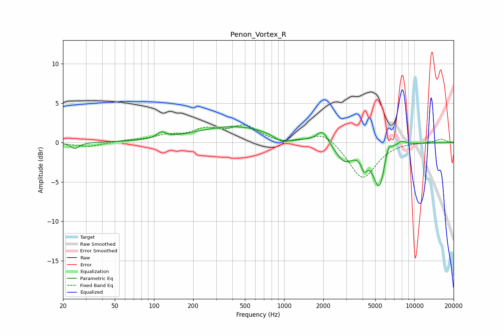

# Penon_Vortex_R
See [usage instructions](https://github.com/jaakkopasanen/AutoEq#usage) for more options and info.

### Parametric EQs
Apply preamp of -2.1 dB when using parametric equalizer.

|   # | Type    |   Fc (Hz) |    Q |   Gain (dB) |
|-----|---------|-----------|------|-------------|
|   1 | Peaking |        25 | 4.34 |        -0.8 |
|   2 | Peaking |       114 | 4.06 |         0.8 |
|   3 | Peaking |       422 | 0.46 |         2.1 |
|   4 | Peaking |       967 | 2.15 |        -1   |
|   5 | Peaking |      1971 | 3.28 |         1.7 |
|   6 | Peaking |      2899 | 2.02 |        -2.3 |
|   7 | Peaking |      4113 | 6    |        -1.7 |
|   8 | Peaking |      5404 | 2.77 |        -6   |
|   9 | Peaking |      6248 | 4.15 |         2.2 |
|  10 | Peaking |      7931 | 3.15 |         0.7 |

### Fixed Band EQs
When using fixed band (also called graphic) equalizer, apply preamp of **-2.3 dB** (if available) and set gains manually with these parameters.

|   # | Type    |   Fc (Hz) |    Q |   Gain (dB) |
|-----|---------|-----------|------|-------------|
|   1 | Peaking |        31 | 1.41 |        -0.6 |
|   2 | Peaking |        62 | 1.41 |         0.2 |
|   3 | Peaking |       125 | 1.41 |         0.7 |
|   4 | Peaking |       250 | 1.41 |         1.5 |
|   5 | Peaking |       500 | 1.41 |         2   |
|   6 | Peaking |      1000 | 1.41 |        -0.3 |
|   7 | Peaking |      2000 | 1.41 |         1.5 |
|   8 | Peaking |      4000 | 1.41 |        -4.7 |
|   9 | Peaking |      8000 | 1.41 |         0.1 |
|  10 | Peaking |     16000 | 1.41 |         0.5 |

### Graphs

