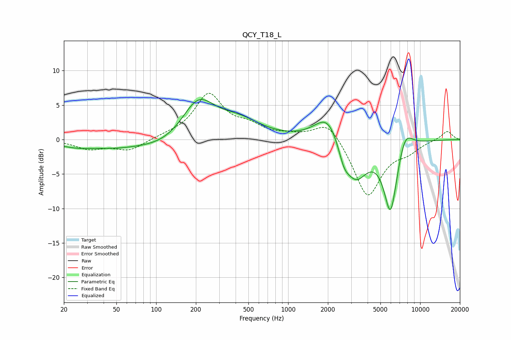

# QCY_T18_L
See [usage instructions](https://github.com/jaakkopasanen/AutoEq#usage) for more options and info.

### Parametric EQs
Apply preamp of -5.9 dB when using parametric equalizer.

|   # | Type    |   Fc (Hz) |    Q |   Gain (dB) |
|-----|---------|-----------|------|-------------|
|   1 | Peaking |        25 | 0.99 |        -0.9 |
|   2 | Peaking |        48 | 0.86 |        -0.7 |
|   3 | Peaking |       140 | 0.57 |        -2.2 |
|   4 | Peaking |       207 | 1.04 |         6.7 |
|   5 | Peaking |       423 | 0.84 |         2.5 |
|   6 | Peaking |      2011 | 1.44 |         4.3 |
|   7 | Peaking |      2647 | 3.25 |        -2.5 |
|   8 | Peaking |      3257 | 1.6  |        -5.6 |
|   9 | Peaking |      5967 | 2.61 |       -10.4 |
|  10 | Peaking |      7674 | 2.36 |         3.2 |

### Fixed Band EQs
When using fixed band (also called graphic) equalizer, apply preamp of **-6.8 dB** (if available) and set gains manually with these parameters.

|   # | Type    |   Fc (Hz) |    Q |   Gain (dB) |
|-----|---------|-----------|------|-------------|
|   1 | Peaking |        31 | 1.41 |        -1.3 |
|   2 | Peaking |        62 | 1.41 |        -1.6 |
|   3 | Peaking |       125 | 1.41 |         0.4 |
|   4 | Peaking |       250 | 1.41 |         6.4 |
|   5 | Peaking |       500 | 1.41 |         1.6 |
|   6 | Peaking |      1000 | 1.41 |         0.5 |
|   7 | Peaking |      2000 | 1.41 |         3   |
|   8 | Peaking |      4000 | 1.41 |        -8.4 |
|   9 | Peaking |      8000 | 1.41 |        -1.3 |
|  10 | Peaking |     16000 | 1.41 |         1.3 |

### Graphs

