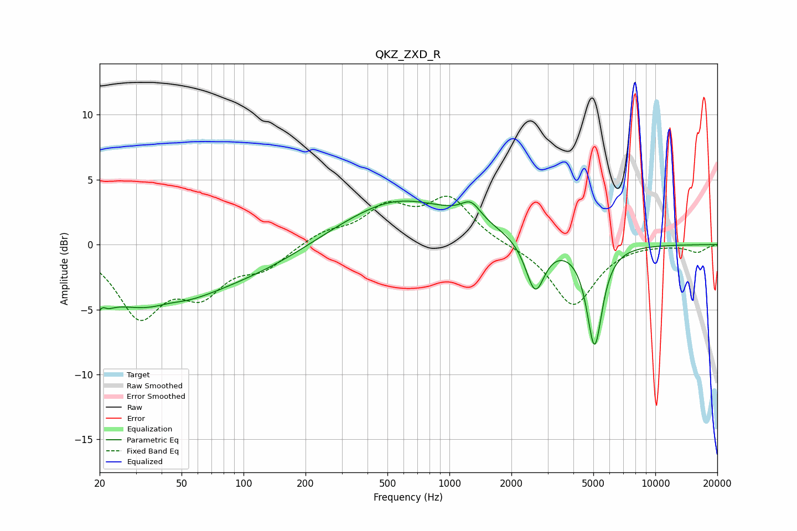

# QKZ_ZXD_R
See [usage instructions](https://github.com/jaakkopasanen/AutoEq#usage) for more options and info.

### Parametric EQs
Apply preamp of -3.4 dB when using parametric equalizer.

|   # | Type    |   Fc (Hz) |    Q |   Gain (dB) |
|-----|---------|-----------|------|-------------|
|   1 | Peaking |        20 | 4.31 |        -4.6 |
|   2 | Peaking |        20 | 5.84 |         3.3 |
|   3 | Peaking |        35 | 0.47 |        -4.7 |
|   4 | Peaking |        43 | 1.93 |         0.4 |
|   5 | Peaking |       133 | 0.51 |        -1.4 |
|   6 | Peaking |       525 | 1.13 |         0.3 |
|   7 | Peaking |       575 | 0.42 |         3.4 |
|   8 | Peaking |      1273 | 2.99 |         1.3 |
|   9 | Peaking |      2609 | 3.11 |        -4   |
|  10 | Peaking |      5069 | 3.71 |        -7.8 |

### Fixed Band EQs
When using fixed band (also called graphic) equalizer, apply preamp of **-3.8 dB** (if available) and set gains manually with these parameters.

|   # | Type    |   Fc (Hz) |    Q |   Gain (dB) |
|-----|---------|-----------|------|-------------|
|   1 | Peaking |        31 | 1.41 |        -5.2 |
|   2 | Peaking |        62 | 1.41 |        -3.2 |
|   3 | Peaking |       125 | 1.41 |        -1.6 |
|   4 | Peaking |       250 | 1.41 |         0.9 |
|   5 | Peaking |       500 | 1.41 |         2.6 |
|   6 | Peaking |      1000 | 1.41 |         3.4 |
|   7 | Peaking |      2000 | 1.41 |        -0.1 |
|   8 | Peaking |      4000 | 1.41 |        -4.7 |
|   9 | Peaking |      8000 | 1.41 |         0.1 |
|  10 | Peaking |     16000 | 1.41 |        -0.6 |

### Graphs

