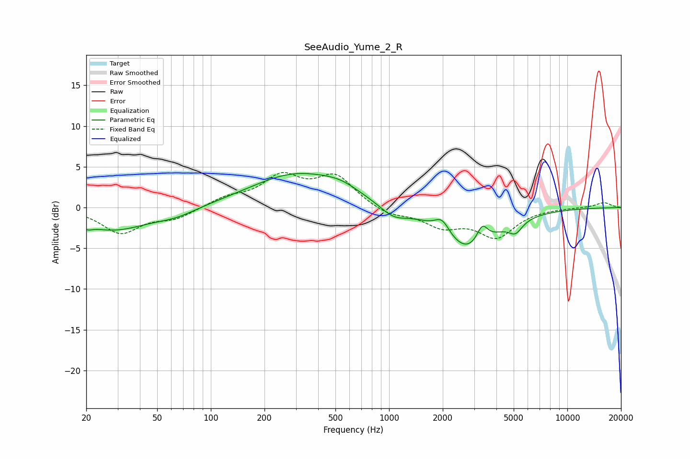

# SeeAudio_Yume_2_R
See [usage instructions](https://github.com/jaakkopasanen/AutoEq#usage) for more options and info.

### Parametric EQs
Apply preamp of -4.3 dB when using parametric equalizer.

|   # | Type    |   Fc (Hz) |    Q |   Gain (dB) |
|-----|---------|-----------|------|-------------|
|   1 | Peaking |        20 | 5.62 |        -0.5 |
|   2 | Peaking |        28 | 0.71 |        -2.7 |
|   3 | Peaking |        64 | 1.24 |        -0.8 |
|   4 | Peaking |       303 | 0.55 |         4.1 |
|   5 | Peaking |       535 | 1.4  |         0.9 |
|   6 | Peaking |      1057 | 1.88 |        -1.4 |
|   7 | Peaking |      1984 | 3.37 |         1.8 |
|   8 | Peaking |      2781 | 0.96 |        -5.4 |
|   9 | Peaking |      3332 | 4.43 |         2.3 |
|  10 | Peaking |      5120 | 3.7  |        -1.4 |

### Fixed Band EQs
When using fixed band (also called graphic) equalizer, apply preamp of **-4.4 dB** (if available) and set gains manually with these parameters.

|   # | Type    |   Fc (Hz) |    Q |   Gain (dB) |
|-----|---------|-----------|------|-------------|
|   1 | Peaking |        31 | 1.41 |        -3.1 |
|   2 | Peaking |        62 | 1.41 |        -1.2 |
|   3 | Peaking |       125 | 1.41 |         1.1 |
|   4 | Peaking |       250 | 1.41 |         3.5 |
|   5 | Peaking |       500 | 1.41 |         3.7 |
|   6 | Peaking |      1000 | 1.41 |        -1   |
|   7 | Peaking |      2000 | 1.41 |        -2.1 |
|   8 | Peaking |      4000 | 1.41 |        -3.5 |
|   9 | Peaking |      8000 | 1.41 |        -0   |
|  10 | Peaking |     16000 | 1.41 |         0.6 |

### Graphs

