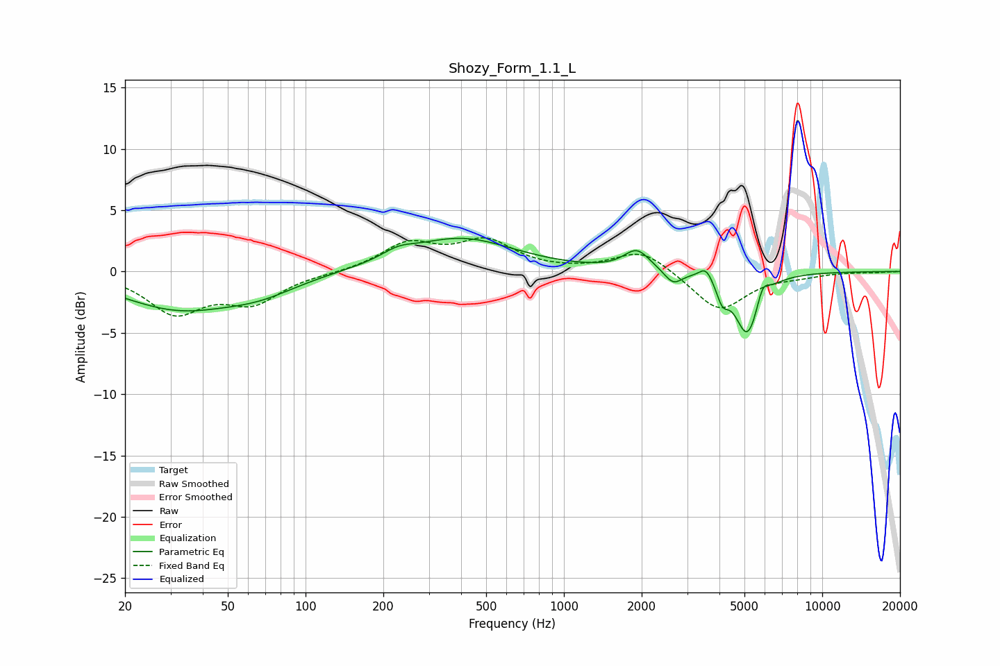

# Shozy_Form_1.1_L
See [usage instructions](https://github.com/jaakkopasanen/AutoEq#usage) for more options and info.

### Parametric EQs
Apply preamp of -2.8 dB when using parametric equalizer.

|   # | Type    |   Fc (Hz) |    Q |   Gain (dB) |
|-----|---------|-----------|------|-------------|
|   1 | Peaking |        32 | 0.64 |        -2.9 |
|   2 | Peaking |        67 | 0.97 |        -1.2 |
|   3 | Peaking |       228 | 2.25 |         0.7 |
|   4 | Peaking |       398 | 0.69 |         2.7 |
|   5 | Peaking |      1917 | 2.84 |         1.7 |
|   6 | Peaking |      2649 | 4.18 |        -1.1 |
|   7 | Peaking |      3550 | 5.37 |         1.1 |
|   8 | Peaking |      4110 | 6    |        -1.6 |
|   9 | Peaking |      5137 | 2.93 |        -5.2 |
|  10 | Peaking |      5874 | 6    |         1.5 |

### Fixed Band EQs
When using fixed band (also called graphic) equalizer, apply preamp of **-2.8 dB** (if available) and set gains manually with these parameters.

|   # | Type    |   Fc (Hz) |    Q |   Gain (dB) |
|-----|---------|-----------|------|-------------|
|   1 | Peaking |        31 | 1.41 |        -3.2 |
|   2 | Peaking |        62 | 1.41 |        -2.3 |
|   3 | Peaking |       125 | 1.41 |        -0.1 |
|   4 | Peaking |       250 | 1.41 |         2.2 |
|   5 | Peaking |       500 | 1.41 |         2.3 |
|   6 | Peaking |      1000 | 1.41 |        -0   |
|   7 | Peaking |      2000 | 1.41 |         1.8 |
|   8 | Peaking |      4000 | 1.41 |        -3.2 |
|   9 | Peaking |      8000 | 1.41 |        -0.3 |
|  10 | Peaking |     16000 | 1.41 |        -0.1 |

### Graphs

