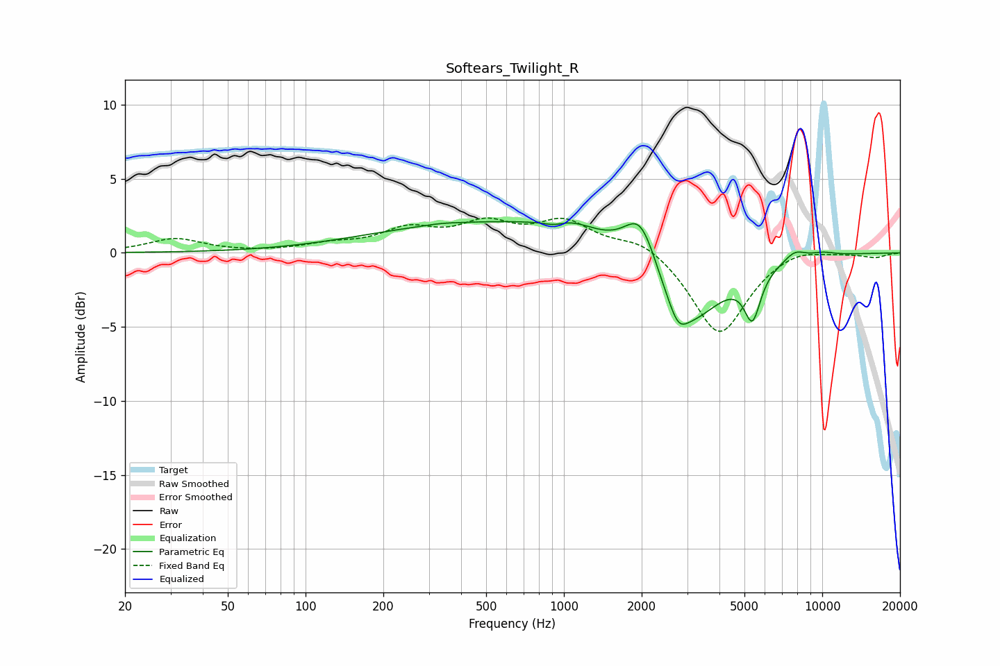

# Softears_Twilight_R
See [usage instructions](https://github.com/jaakkopasanen/AutoEq#usage) for more options and info.

### Parametric EQs
Apply preamp of -2.2 dB when using parametric equalizer.

|   # | Type    |   Fc (Hz) |    Q |   Gain (dB) |
|-----|---------|-----------|------|-------------|
|   1 | Peaking |       334 | 2.68 |         0.1 |
|   2 | Peaking |       621 | 0.26 |         2.2 |
|   3 | Peaking |       916 | 3.61 |        -0.3 |
|   4 | Peaking |      1064 | 1.66 |         0.6 |
|   5 | Peaking |      1988 | 2.2  |         3.7 |
|   6 | Peaking |      2765 | 4.11 |        -1.3 |
|   7 | Peaking |      2941 | 1    |        -5.5 |
|   8 | Peaking |      5368 | 4.42 |        -3.2 |
|   9 | Peaking |      7824 | 3.22 |         0.7 |
|  10 | Peaking |     10000 | 2.39 |         0.3 |

### Fixed Band EQs
When using fixed band (also called graphic) equalizer, apply preamp of **-2.5 dB** (if available) and set gains manually with these parameters.

|   # | Type    |   Fc (Hz) |    Q |   Gain (dB) |
|-----|---------|-----------|------|-------------|
|   1 | Peaking |        31 | 1.41 |         0.9 |
|   2 | Peaking |        62 | 1.41 |        -0   |
|   3 | Peaking |       125 | 1.41 |         0.5 |
|   4 | Peaking |       250 | 1.41 |         1.4 |
|   5 | Peaking |       500 | 1.41 |         1.7 |
|   6 | Peaking |      1000 | 1.41 |         2   |
|   7 | Peaking |      2000 | 1.41 |         1   |
|   8 | Peaking |      4000 | 1.41 |        -5.6 |
|   9 | Peaking |      8000 | 1.41 |         0.5 |
|  10 | Peaking |     16000 | 1.41 |        -0.3 |

### Graphs

