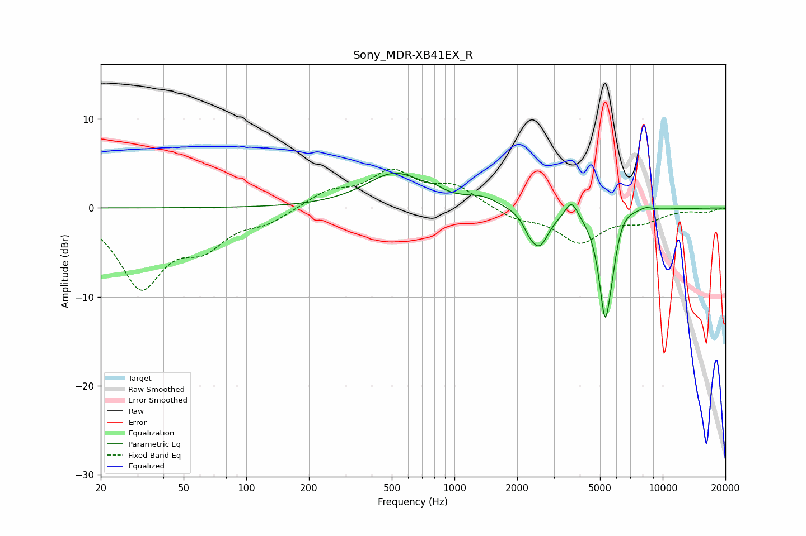

# Sony_MDR-XB41EX_R
See [usage instructions](https://github.com/jaakkopasanen/AutoEq#usage) for more options and info.

### Parametric EQs
Apply preamp of -4.0 dB when using parametric equalizer.

|   # | Type    |   Fc (Hz) |    Q |   Gain (dB) |
|-----|---------|-----------|------|-------------|
|   1 | Peaking |       518 | 1    |         3.8 |
|   2 | Peaking |       801 | 3.56 |         0.5 |
|   3 | Peaking |      1366 | 1.77 |         0.9 |
|   4 | Peaking |      2270 | 5.83 |        -0.7 |
|   5 | Peaking |      2546 | 3.04 |        -4.2 |
|   6 | Peaking |      3651 | 4.86 |         1.9 |
|   7 | Peaking |      5289 | 4.54 |       -11.9 |
|   8 | Peaking |      5709 | 6    |        -1.7 |
|   9 | Peaking |      6491 | 2.88 |         0.9 |
|  10 | Peaking |      8285 | 3.85 |         0.4 |

### Fixed Band EQs
When using fixed band (also called graphic) equalizer, apply preamp of **-4.5 dB** (if available) and set gains manually with these parameters.

|   # | Type    |   Fc (Hz) |    Q |   Gain (dB) |
|-----|---------|-----------|------|-------------|
|   1 | Peaking |        31 | 1.41 |        -8.6 |
|   2 | Peaking |        62 | 1.41 |        -3.5 |
|   3 | Peaking |       125 | 1.41 |        -1.4 |
|   4 | Peaking |       250 | 1.41 |         1.7 |
|   5 | Peaking |       500 | 1.41 |         3.8 |
|   6 | Peaking |      1000 | 1.41 |         2.2 |
|   7 | Peaking |      2000 | 1.41 |        -1.1 |
|   8 | Peaking |      4000 | 1.41 |        -3.7 |
|   9 | Peaking |      8000 | 1.41 |        -1.3 |
|  10 | Peaking |     16000 | 1.41 |        -0.4 |

### Graphs

