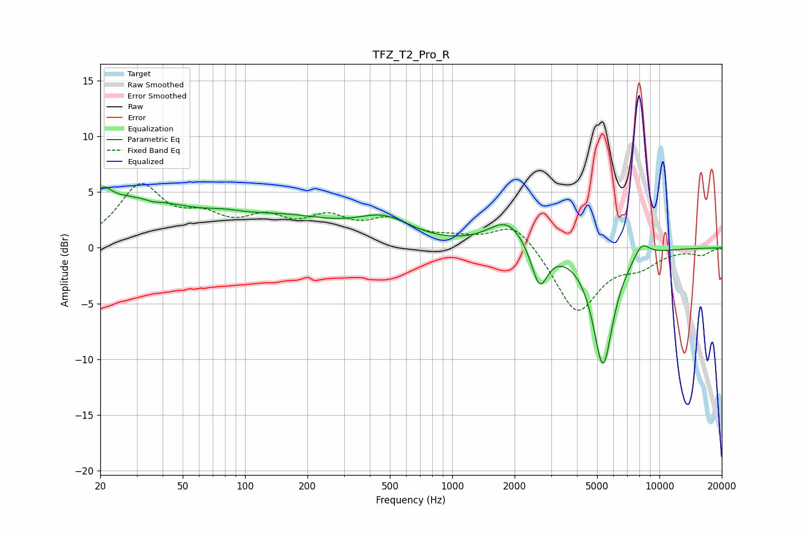

# TFZ_T2_Pro_R
See [usage instructions](https://github.com/jaakkopasanen/AutoEq#usage) for more options and info.

### Parametric EQs
Apply preamp of -5.5 dB when using parametric equalizer.

|   # | Type    |   Fc (Hz) |    Q |   Gain (dB) |
|-----|---------|-----------|------|-------------|
|   1 | Peaking |        20 | 0.32 |         4.5 |
|   2 | Peaking |        21 | 4.85 |         0.8 |
|   3 | Peaking |        36 | 5.45 |        -0.2 |
|   4 | Peaking |        80 | 1.81 |         0.3 |
|   5 | Peaking |       162 | 0.56 |         2.1 |
|   6 | Peaking |       469 | 1.06 |         2.1 |
|   7 | Peaking |      1850 | 1.55 |         2.5 |
|   8 | Peaking |      2637 | 3.58 |        -3.8 |
|   9 | Peaking |      5341 | 2.78 |       -10.5 |
|  10 | Peaking |      8207 | 3.48 |         1.4 |

### Fixed Band EQs
When using fixed band (also called graphic) equalizer, apply preamp of **-5.9 dB** (if available) and set gains manually with these parameters.

|   # | Type    |   Fc (Hz) |    Q |   Gain (dB) |
|-----|---------|-----------|------|-------------|
|   1 | Peaking |        31 | 1.41 |         5.3 |
|   2 | Peaking |        62 | 1.41 |         2.1 |
|   3 | Peaking |       125 | 1.41 |         2.1 |
|   4 | Peaking |       250 | 1.41 |         2.2 |
|   5 | Peaking |       500 | 1.41 |         2.1 |
|   6 | Peaking |      1000 | 1.41 |         0.6 |
|   7 | Peaking |      2000 | 1.41 |         2.4 |
|   8 | Peaking |      4000 | 1.41 |        -5.9 |
|   9 | Peaking |      8000 | 1.41 |        -1.4 |
|  10 | Peaking |     16000 | 1.41 |        -0.6 |

### Graphs

