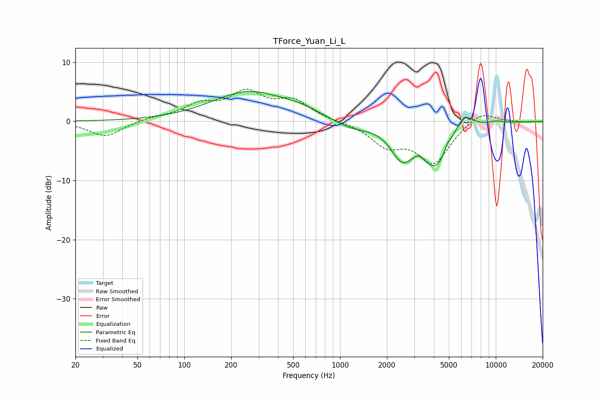

# TForce_Yuan_Li_L
See [usage instructions](https://github.com/jaakkopasanen/AutoEq#usage) for more options and info.

### Parametric EQs
Apply preamp of -5.2 dB when using parametric equalizer.

|   # | Type    |   Fc (Hz) |    Q |   Gain (dB) |
|-----|---------|-----------|------|-------------|
|   1 | Peaking |       260 | 0.59 |         5   |
|   2 | Peaking |       560 | 1.24 |         0.9 |
|   3 | Peaking |      1177 | 1.32 |        -1.2 |
|   4 | Peaking |      2223 | 2.74 |        -0.5 |
|   5 | Peaking |      2520 | 2.22 |        -3.9 |
|   6 | Peaking |      3205 | 3.94 |         1.1 |
|   7 | Peaking |      4227 | 1.16 |        -8.6 |
|   8 | Peaking |      4893 | 4.8  |         1.7 |
|   9 | Peaking |      6148 | 1.96 |         4.5 |
|  10 | Peaking |     10000 | 2.11 |         0.5 |

### Fixed Band EQs
When using fixed band (also called graphic) equalizer, apply preamp of **-5.5 dB** (if available) and set gains manually with these parameters.

|   # | Type    |   Fc (Hz) |    Q |   Gain (dB) |
|-----|---------|-----------|------|-------------|
|   1 | Peaking |        31 | 1.41 |        -2.6 |
|   2 | Peaking |        62 | 1.41 |         0.6 |
|   3 | Peaking |       125 | 1.41 |         2.5 |
|   4 | Peaking |       250 | 1.41 |         4.4 |
|   5 | Peaking |       500 | 1.41 |         3.2 |
|   6 | Peaking |      1000 | 1.41 |         0   |
|   7 | Peaking |      2000 | 1.41 |        -3.7 |
|   8 | Peaking |      4000 | 1.41 |        -6.8 |
|   9 | Peaking |      8000 | 1.41 |         2   |
|  10 | Peaking |     16000 | 1.41 |        -0.1 |

### Graphs

