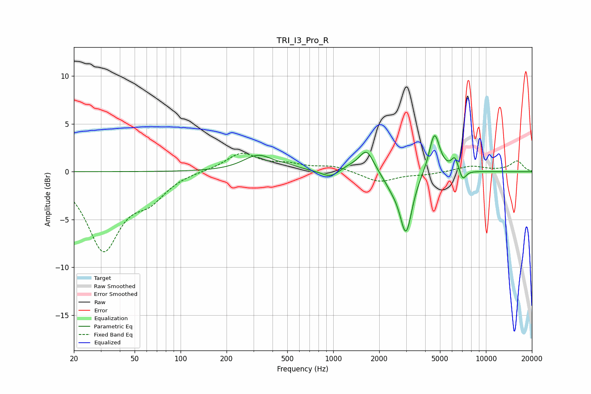

# TRI_I3_Pro_R
See [usage instructions](https://github.com/jaakkopasanen/AutoEq#usage) for more options and info.

### Parametric EQs
Apply preamp of -3.9 dB when using parametric equalizer.

|   # | Type    |   Fc (Hz) |    Q |   Gain (dB) |
|-----|---------|-----------|------|-------------|
|   1 | Peaking |       323 | 1.43 |         1.7 |
|   2 | Peaking |       506 | 2.41 |         0.3 |
|   3 | Peaking |       961 | 2.42 |        -0.8 |
|   4 | Peaking |      1271 | 2.13 |         0.5 |
|   5 | Peaking |      1652 | 2.98 |         2.3 |
|   6 | Peaking |      2419 | 2.64 |        -1   |
|   7 | Peaking |      2995 | 3.51 |        -6.2 |
|   8 | Peaking |      4600 | 4.03 |         4.3 |
|   9 | Peaking |      6256 | 6    |         1.4 |
|  10 | Peaking |      7040 | 6    |        -1.1 |

### Fixed Band EQs
When using fixed band (also called graphic) equalizer, apply preamp of **-2.0 dB** (if available) and set gains manually with these parameters.

|   # | Type    |   Fc (Hz) |    Q |   Gain (dB) |
|-----|---------|-----------|------|-------------|
|   1 | Peaking |        31 | 1.41 |        -8   |
|   2 | Peaking |        62 | 1.41 |        -2.3 |
|   3 | Peaking |       125 | 1.41 |         0.1 |
|   4 | Peaking |       250 | 1.41 |         1.9 |
|   5 | Peaking |       500 | 1.41 |         0.6 |
|   6 | Peaking |      1000 | 1.41 |         0.6 |
|   7 | Peaking |      2000 | 1.41 |        -1.1 |
|   8 | Peaking |      4000 | 1.41 |        -0.3 |
|   9 | Peaking |      8000 | 1.41 |         0.6 |
|  10 | Peaking |     16000 | 1.41 |         1.1 |

### Graphs

