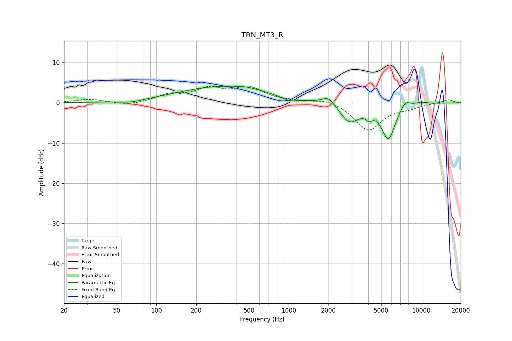

# TRN_MT3_R
See [usage instructions](https://github.com/jaakkopasanen/AutoEq#usage) for more options and info.

### Parametric EQs
Apply preamp of -4.2 dB when using parametric equalizer.

|   # | Type    |   Fc (Hz) |    Q |   Gain (dB) |
|-----|---------|-----------|------|-------------|
|   1 | Peaking |        64 | 1.62 |        -0.6 |
|   2 | Peaking |       310 | 0.42 |         4   |
|   3 | Peaking |       492 | 1.58 |         0.5 |
|   4 | Peaking |      1018 | 2.58 |        -0.9 |
|   5 | Peaking |      2004 | 2.88 |         2.2 |
|   6 | Peaking |      2880 | 1.92 |        -4.7 |
|   7 | Peaking |      4046 | 6    |        -1.5 |
|   8 | Peaking |      5669 | 2.66 |        -8.8 |
|   9 | Peaking |      7601 | 3.62 |         2   |
|  10 | Peaking |      9989 | 2.7  |         0.6 |

### Fixed Band EQs
When using fixed band (also called graphic) equalizer, apply preamp of **-4.3 dB** (if available) and set gains manually with these parameters.

|   # | Type    |   Fc (Hz) |    Q |   Gain (dB) |
|-----|---------|-----------|------|-------------|
|   1 | Peaking |        31 | 1.41 |         0.9 |
|   2 | Peaking |        62 | 1.41 |        -0.7 |
|   3 | Peaking |       125 | 1.41 |         1.8 |
|   4 | Peaking |       250 | 1.41 |         3.1 |
|   5 | Peaking |       500 | 1.41 |         3.5 |
|   6 | Peaking |      1000 | 1.41 |         0.3 |
|   7 | Peaking |      2000 | 1.41 |         1.1 |
|   8 | Peaking |      4000 | 1.41 |        -6.9 |
|   9 | Peaking |      8000 | 1.41 |        -0.9 |
|  10 | Peaking |     16000 | 1.41 |         0.8 |

### Graphs

