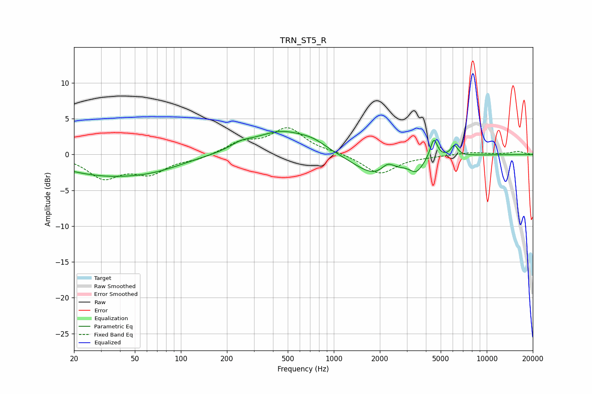

# TRN_ST5_R
See [usage instructions](https://github.com/jaakkopasanen/AutoEq#usage) for more options and info.

### Parametric EQs
Apply preamp of -3.3 dB when using parametric equalizer.

|   # | Type    |   Fc (Hz) |    Q |   Gain (dB) |
|-----|---------|-----------|------|-------------|
|   1 | Peaking |        30 | 0.49 |        -2.5 |
|   2 | Peaking |        67 | 0.69 |        -1.2 |
|   3 | Peaking |       247 | 2.12 |         0.7 |
|   4 | Peaking |       456 | 0.76 |         3.2 |
|   5 | Peaking |       737 | 1.67 |         0.8 |
|   6 | Peaking |      1916 | 0.97 |        -3.2 |
|   7 | Peaking |      2249 | 3.3  |         1.4 |
|   8 | Peaking |      3469 | 3.26 |        -1.6 |
|   9 | Peaking |      4504 | 6    |         2.8 |
|  10 | Peaking |      6133 | 6    |         1.5 |

### Fixed Band EQs
When using fixed band (also called graphic) equalizer, apply preamp of **-3.8 dB** (if available) and set gains manually with these parameters.

|   # | Type    |   Fc (Hz) |    Q |   Gain (dB) |
|-----|---------|-----------|------|-------------|
|   1 | Peaking |        31 | 1.41 |        -3.1 |
|   2 | Peaking |        62 | 1.41 |        -2.4 |
|   3 | Peaking |       125 | 1.41 |        -0.6 |
|   4 | Peaking |       250 | 1.41 |         1.6 |
|   5 | Peaking |       500 | 1.41 |         3.5 |
|   6 | Peaking |      1000 | 1.41 |         0.2 |
|   7 | Peaking |      2000 | 1.41 |        -2.7 |
|   8 | Peaking |      4000 | 1.41 |        -0.2 |
|   9 | Peaking |      8000 | 1.41 |         0.3 |
|  10 | Peaking |     16000 | 1.41 |         0.4 |

### Graphs

