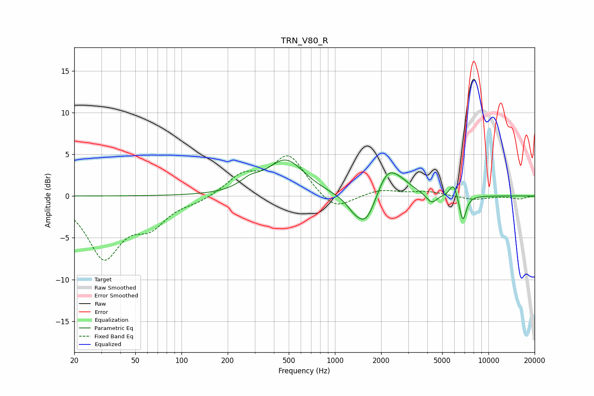

# TRN_V80_R
See [usage instructions](https://github.com/jaakkopasanen/AutoEq#usage) for more options and info.

### Parametric EQs
Apply preamp of -4.4 dB when using parametric equalizer.

|   # | Type    |   Fc (Hz) |    Q |   Gain (dB) |
|-----|---------|-----------|------|-------------|
|   1 | Peaking |       279 | 2.13 |         1   |
|   2 | Peaking |       479 | 1.17 |         4.2 |
|   3 | Peaking |      1308 | 3.78 |        -0.5 |
|   4 | Peaking |      1518 | 1.47 |        -0.8 |
|   5 | Peaking |      1586 | 2.06 |        -3.4 |
|   6 | Peaking |      2192 | 1.94 |         3.4 |
|   7 | Peaking |      2743 | 1.86 |         0.9 |
|   8 | Peaking |      4266 | 4.02 |        -1.2 |
|   9 | Peaking |      5922 | 5.56 |         1.7 |
|  10 | Peaking |      6810 | 6    |        -3.2 |

### Fixed Band EQs
When using fixed band (also called graphic) equalizer, apply preamp of **-4.9 dB** (if available) and set gains manually with these parameters.

|   # | Type    |   Fc (Hz) |    Q |   Gain (dB) |
|-----|---------|-----------|------|-------------|
|   1 | Peaking |        31 | 1.41 |        -7.1 |
|   2 | Peaking |        62 | 1.41 |        -3   |
|   3 | Peaking |       125 | 1.41 |        -0.6 |
|   4 | Peaking |       250 | 1.41 |         2.3 |
|   5 | Peaking |       500 | 1.41 |         4.8 |
|   6 | Peaking |      1000 | 1.41 |        -2   |
|   7 | Peaking |      2000 | 1.41 |         0.7 |
|   8 | Peaking |      4000 | 1.41 |         0.5 |
|   9 | Peaking |      8000 | 1.41 |        -0.4 |
|  10 | Peaking |     16000 | 1.41 |        -0.3 |

### Graphs

