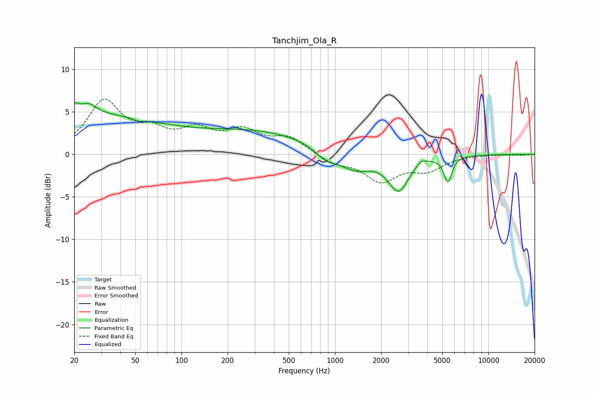

# Tanchjim_Ola_R
See [usage instructions](https://github.com/jaakkopasanen/AutoEq#usage) for more options and info.

### Parametric EQs
Apply preamp of -6.1 dB when using parametric equalizer.

|   # | Type    |   Fc (Hz) |    Q |   Gain (dB) |
|-----|---------|-----------|------|-------------|
|   1 | Peaking |        20 | 5.61 |         0.9 |
|   2 | Peaking |        22 | 0.24 |         4.5 |
|   3 | Peaking |        25 | 2.69 |         1.2 |
|   4 | Peaking |        54 | 5.79 |        -0.4 |
|   5 | Peaking |       324 | 0.37 |         2.5 |
|   6 | Peaking |       874 | 1.99 |        -1.3 |
|   7 | Peaking |      1355 | 1.29 |        -2.1 |
|   8 | Peaking |      2594 | 2.14 |        -4.1 |
|   9 | Peaking |      3642 | 4.86 |         0.5 |
|  10 | Peaking |      5443 | 5.47 |        -3   |

### Fixed Band EQs
When using fixed band (also called graphic) equalizer, apply preamp of **-6.6 dB** (if available) and set gains manually with these parameters.

|   # | Type    |   Fc (Hz) |    Q |   Gain (dB) |
|-----|---------|-----------|------|-------------|
|   1 | Peaking |        31 | 1.41 |         6   |
|   2 | Peaking |        62 | 1.41 |         2.2 |
|   3 | Peaking |       125 | 1.41 |         2.4 |
|   4 | Peaking |       250 | 1.41 |         2.4 |
|   5 | Peaking |       500 | 1.41 |         1.8 |
|   6 | Peaking |      1000 | 1.41 |        -1   |
|   7 | Peaking |      2000 | 1.41 |        -3   |
|   8 | Peaking |      4000 | 1.41 |        -1.7 |
|   9 | Peaking |      8000 | 1.41 |        -0   |
|  10 | Peaking |     16000 | 1.41 |        -0.1 |

### Graphs

