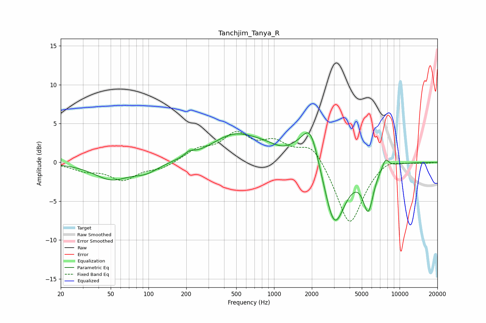

# Tanchjim_Tanya_R
See [usage instructions](https://github.com/jaakkopasanen/AutoEq#usage) for more options and info.

### Parametric EQs
Apply preamp of -3.9 dB when using parametric equalizer.

|   # | Type    |   Fc (Hz) |    Q |   Gain (dB) |
|-----|---------|-----------|------|-------------|
|   1 | Peaking |        51 | 1.02 |        -2.1 |
|   2 | Peaking |        96 | 1.42 |        -1.1 |
|   3 | Peaking |       212 | 3.89 |         0.6 |
|   4 | Peaking |       471 | 0.77 |         2.8 |
|   5 | Peaking |      1192 | 1.39 |        -1.5 |
|   6 | Peaking |      1742 | 0.49 |         4   |
|   7 | Peaking |      1951 | 2.32 |         3.9 |
|   8 | Peaking |      3014 | 1.44 |       -10.8 |
|   9 | Peaking |      5628 | 3.3  |        -5.4 |
|  10 | Peaking |      7726 | 4.95 |         1.3 |

### Fixed Band EQs
When using fixed band (also called graphic) equalizer, apply preamp of **-4.1 dB** (if available) and set gains manually with these parameters.

|   # | Type    |   Fc (Hz) |    Q |   Gain (dB) |
|-----|---------|-----------|------|-------------|
|   1 | Peaking |        31 | 1.41 |        -0.9 |
|   2 | Peaking |        62 | 1.41 |        -2.1 |
|   3 | Peaking |       125 | 1.41 |        -0.8 |
|   4 | Peaking |       250 | 1.41 |         1.5 |
|   5 | Peaking |       500 | 1.41 |         3.3 |
|   6 | Peaking |      1000 | 1.41 |         2.2 |
|   7 | Peaking |      2000 | 1.41 |         2.6 |
|   8 | Peaking |      4000 | 1.41 |        -8.2 |
|   9 | Peaking |      8000 | 1.41 |         0.8 |
|  10 | Peaking |     16000 | 1.41 |        -0.1 |

### Graphs

