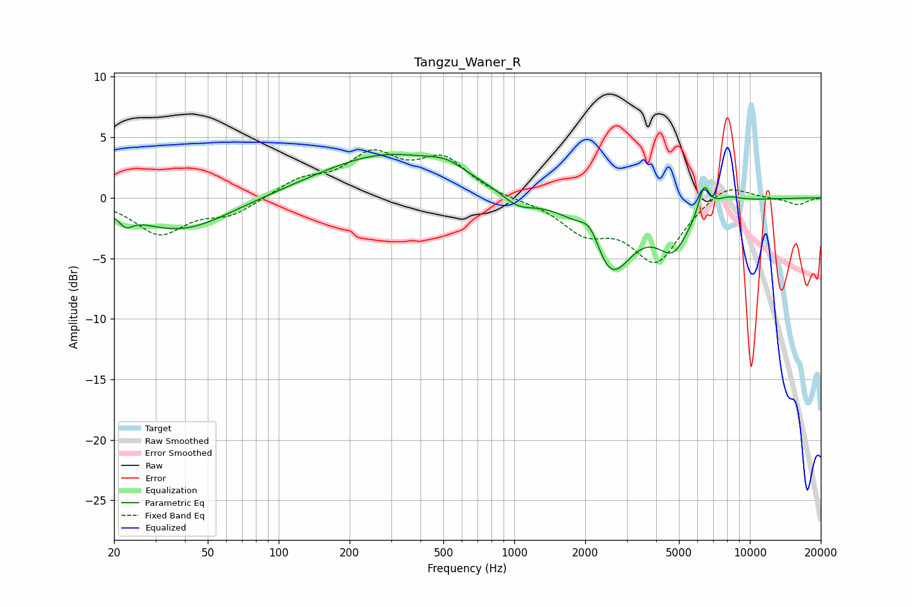

# Tangzu_Waner_R
See [usage instructions](https://github.com/jaakkopasanen/AutoEq#usage) for more options and info.

### Parametric EQs
Apply preamp of -3.7 dB when using parametric equalizer.

|   # | Type    |   Fc (Hz) |    Q |   Gain (dB) |
|-----|---------|-----------|------|-------------|
|   1 | Peaking |        22 | 5.29 |        -0.8 |
|   2 | Peaking |        38 | 0.69 |        -2.8 |
|   3 | Peaking |       289 | 0.49 |         3.6 |
|   4 | Peaking |       516 | 1.86 |         0.8 |
|   5 | Peaking |      1036 | 2.04 |        -1.1 |
|   6 | Peaking |      2114 | 3.01 |         2.3 |
|   7 | Peaking |      2537 | 1.49 |        -6.5 |
|   8 | Peaking |      4728 | 2    |        -3.5 |
|   9 | Peaking |      6382 | 6    |         2.4 |
|  10 | Peaking |      8051 | 2.35 |         0.6 |

### Fixed Band EQs
When using fixed band (also called graphic) equalizer, apply preamp of **-4.1 dB** (if available) and set gains manually with these parameters.

|   # | Type    |   Fc (Hz) |    Q |   Gain (dB) |
|-----|---------|-----------|------|-------------|
|   1 | Peaking |        31 | 1.41 |        -2.9 |
|   2 | Peaking |        62 | 1.41 |        -1.3 |
|   3 | Peaking |       125 | 1.41 |         1.4 |
|   4 | Peaking |       250 | 1.41 |         3.3 |
|   5 | Peaking |       500 | 1.41 |         3   |
|   6 | Peaking |      1000 | 1.41 |        -0.1 |
|   7 | Peaking |      2000 | 1.41 |        -2.5 |
|   8 | Peaking |      4000 | 1.41 |        -5.1 |
|   9 | Peaking |      8000 | 1.41 |         1.4 |
|  10 | Peaking |     16000 | 1.41 |        -0.6 |

### Graphs

