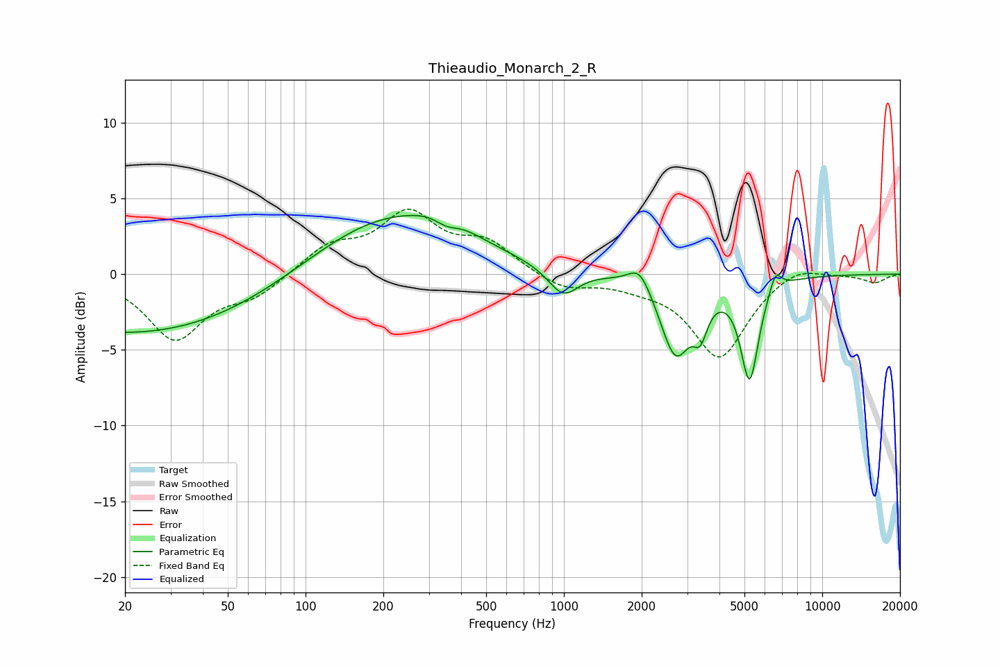

# Thieaudio_Monarch_2_R
See [usage instructions](https://github.com/jaakkopasanen/AutoEq#usage) for more options and info.

### Parametric EQs
Apply preamp of -4.0 dB when using parametric equalizer.

|   # | Type    |   Fc (Hz) |    Q |   Gain (dB) |
|-----|---------|-----------|------|-------------|
|   1 | Peaking |        23 | 0.27 |        -4   |
|   2 | Peaking |       208 | 0.48 |         4   |
|   3 | Peaking |       348 | 1.44 |         1.2 |
|   4 | Peaking |       350 | 2.86 |        -0.9 |
|   5 | Peaking |       994 | 2.43 |        -1.9 |
|   6 | Peaking |      1964 | 3.27 |         1.5 |
|   7 | Peaking |      2704 | 2.38 |        -5.2 |
|   8 | Peaking |      3375 | 5.14 |        -2.1 |
|   9 | Peaking |      5234 | 3.97 |        -6.6 |
|  10 | Peaking |      6589 | 5.94 |         1.3 |

### Fixed Band EQs
When using fixed band (also called graphic) equalizer, apply preamp of **-4.4 dB** (if available) and set gains manually with these parameters.

|   # | Type    |   Fc (Hz) |    Q |   Gain (dB) |
|-----|---------|-----------|------|-------------|
|   1 | Peaking |        31 | 1.41 |        -4.2 |
|   2 | Peaking |        62 | 1.41 |        -1.3 |
|   3 | Peaking |       125 | 1.41 |         1.7 |
|   4 | Peaking |       250 | 1.41 |         3.8 |
|   5 | Peaking |       500 | 1.41 |         1.9 |
|   6 | Peaking |      1000 | 1.41 |        -1   |
|   7 | Peaking |      2000 | 1.41 |        -0.5 |
|   8 | Peaking |      4000 | 1.41 |        -5.5 |
|   9 | Peaking |      8000 | 1.41 |         0.8 |
|  10 | Peaking |     16000 | 1.41 |        -0.6 |

### Graphs

