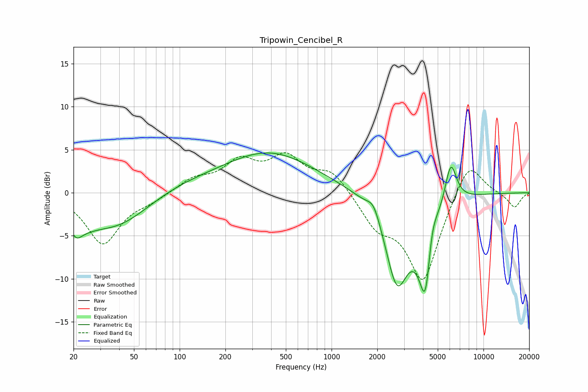

# Tripowin_Cencibel_R
See [usage instructions](https://github.com/jaakkopasanen/AutoEq#usage) for more options and info.

### Parametric EQs
Apply preamp of -4.7 dB when using parametric equalizer.

|   # | Type    |   Fc (Hz) |    Q |   Gain (dB) |
|-----|---------|-----------|------|-------------|
|   1 | Peaking |        21 | 3.8  |        -1.6 |
|   2 | Peaking |        23 | 1.48 |        -1.6 |
|   3 | Peaking |        38 | 0.64 |        -3.9 |
|   4 | Peaking |        95 | 0.59 |         0.9 |
|   5 | Peaking |       388 | 0.46 |         4.6 |
|   6 | Peaking |      1895 | 3.29 |         1.8 |
|   7 | Peaking |      2698 | 1.75 |       -10.1 |
|   8 | Peaking |      4173 | 3    |       -12.2 |
|   9 | Peaking |      4529 | 3.65 |         4.7 |
|  10 | Peaking |      6089 | 3.54 |         5   |

### Fixed Band EQs
When using fixed band (also called graphic) equalizer, apply preamp of **-4.8 dB** (if available) and set gains manually with these parameters.

|   # | Type    |   Fc (Hz) |    Q |   Gain (dB) |
|-----|---------|-----------|------|-------------|
|   1 | Peaking |        31 | 1.41 |        -5.9 |
|   2 | Peaking |        62 | 1.41 |        -0.8 |
|   3 | Peaking |       125 | 1.41 |         1.5 |
|   4 | Peaking |       250 | 1.41 |         3.3 |
|   5 | Peaking |       500 | 1.41 |         3.8 |
|   6 | Peaking |      1000 | 1.41 |         2.5 |
|   7 | Peaking |      2000 | 1.41 |        -3.4 |
|   8 | Peaking |      4000 | 1.41 |       -10.2 |
|   9 | Peaking |      8000 | 1.41 |         4.3 |
|  10 | Peaking |     16000 | 1.41 |        -1.7 |

### Graphs

