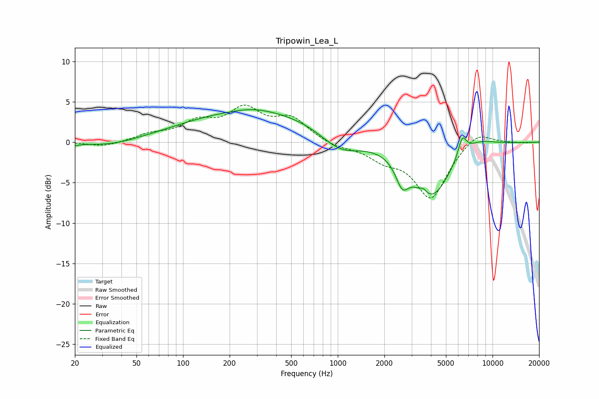

# Tripowin_Lea_L
See [usage instructions](https://github.com/jaakkopasanen/AutoEq#usage) for more options and info.

### Parametric EQs
Apply preamp of -4.1 dB when using parametric equalizer.

|   # | Type    |   Fc (Hz) |    Q |   Gain (dB) |
|-----|---------|-----------|------|-------------|
|   1 | Peaking |        20 | 5.13 |        -0.2 |
|   2 | Peaking |        34 | 0.77 |        -0.7 |
|   3 | Peaking |       285 | 1.23 |         0.4 |
|   4 | Peaking |       308 | 0.28 |         3.9 |
|   5 | Peaking |      1031 | 1.05 |        -2.6 |
|   6 | Peaking |      2610 | 3.45 |        -2.8 |
|   7 | Peaking |      3583 | 6    |         0.6 |
|   8 | Peaking |      4020 | 1.11 |        -6.8 |
|   9 | Peaking |      6376 | 4.93 |         2.5 |
|  10 | Peaking |      7900 | 1.21 |         1.2 |

### Fixed Band EQs
When using fixed band (also called graphic) equalizer, apply preamp of **-4.7 dB** (if available) and set gains manually with these parameters.

|   # | Type    |   Fc (Hz) |    Q |   Gain (dB) |
|-----|---------|-----------|------|-------------|
|   1 | Peaking |        31 | 1.41 |        -0.6 |
|   2 | Peaking |        62 | 1.41 |         0.8 |
|   3 | Peaking |       125 | 1.41 |         2.2 |
|   4 | Peaking |       250 | 1.41 |         3.7 |
|   5 | Peaking |       500 | 1.41 |         2.7 |
|   6 | Peaking |      1000 | 1.41 |        -0.6 |
|   7 | Peaking |      2000 | 1.41 |        -1.7 |
|   8 | Peaking |      4000 | 1.41 |        -6.8 |
|   9 | Peaking |      8000 | 1.41 |         1.6 |
|  10 | Peaking |     16000 | 1.41 |        -0.1 |

### Graphs

