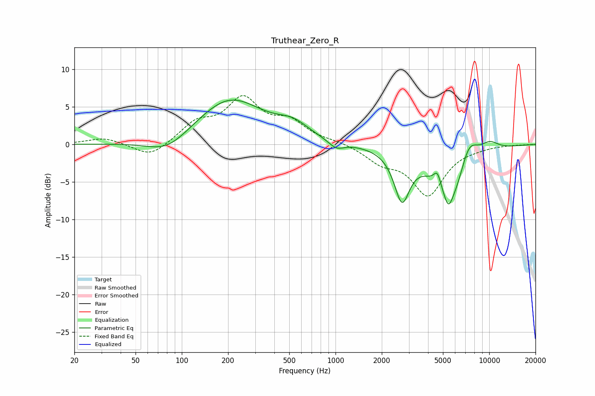

# Truthear_Zero_R
See [usage instructions](https://github.com/jaakkopasanen/AutoEq#usage) for more options and info.

### Parametric EQs
Apply preamp of -6.0 dB when using parametric equalizer.

|   # | Type    |   Fc (Hz) |    Q |   Gain (dB) |
|-----|---------|-----------|------|-------------|
|   1 | Peaking |        81 | 1.05 |        -2.2 |
|   2 | Peaking |       205 | 0.64 |         6.1 |
|   3 | Peaking |       530 | 1.4  |         1.7 |
|   4 | Peaking |      1012 | 2.77 |        -1.1 |
|   5 | Peaking |      2706 | 2.83 |        -6.4 |
|   6 | Peaking |      4597 | 6    |         1.9 |
|   7 | Peaking |      5423 | 5.05 |        -2.1 |
|   8 | Peaking |      5862 | 1.13 |        -7.9 |
|   9 | Peaking |      7323 | 2.07 |         4.8 |
|  10 | Peaking |     10000 | 1.92 |         1.5 |

### Fixed Band EQs
When using fixed band (also called graphic) equalizer, apply preamp of **-6.6 dB** (if available) and set gains manually with these parameters.

|   # | Type    |   Fc (Hz) |    Q |   Gain (dB) |
|-----|---------|-----------|------|-------------|
|   1 | Peaking |        31 | 1.41 |         0.9 |
|   2 | Peaking |        62 | 1.41 |        -1.9 |
|   3 | Peaking |       125 | 1.41 |         2.6 |
|   4 | Peaking |       250 | 1.41 |         5.6 |
|   5 | Peaking |       500 | 1.41 |         2.6 |
|   6 | Peaking |      1000 | 1.41 |         0.3 |
|   7 | Peaking |      2000 | 1.41 |        -2   |
|   8 | Peaking |      4000 | 1.41 |        -6.5 |
|   9 | Peaking |      8000 | 1.41 |        -0.2 |
|  10 | Peaking |     16000 | 1.41 |        -0   |

### Graphs

