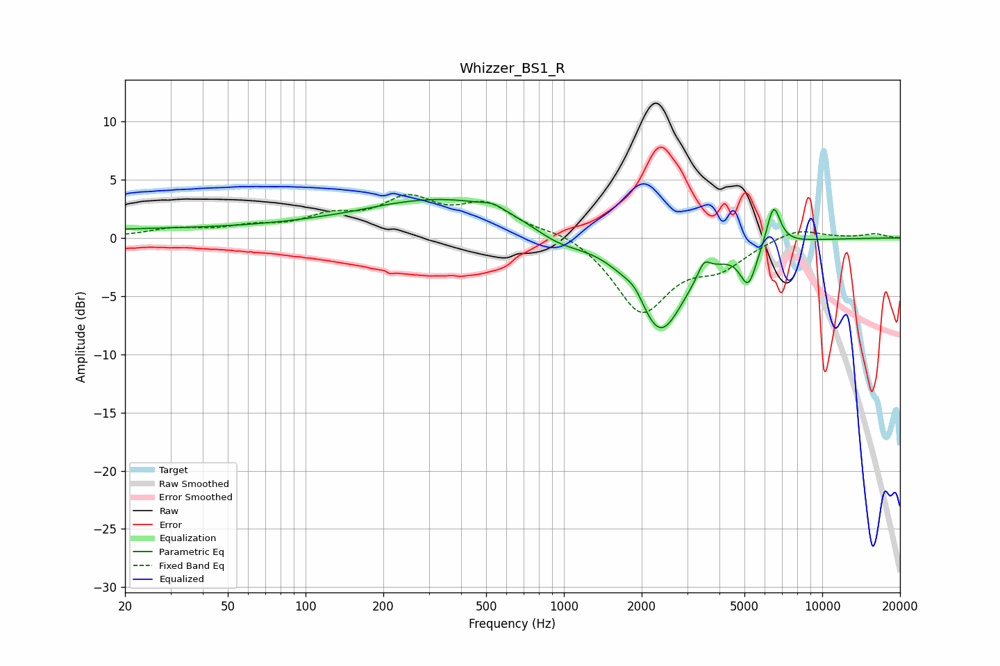

# Whizzer_BS1_R
See [usage instructions](https://github.com/jaakkopasanen/AutoEq#usage) for more options and info.

### Parametric EQs
Apply preamp of -3.4 dB when using parametric equalizer.

|   # | Type    |   Fc (Hz) |    Q |   Gain (dB) |
|-----|---------|-----------|------|-------------|
|   1 | Peaking |        37 | 0.19 |         0.8 |
|   2 | Peaking |       149 | 1.49 |        -0.1 |
|   3 | Peaking |       376 | 0.41 |         3.3 |
|   4 | Peaking |       534 | 3.44 |         0.4 |
|   5 | Peaking |       952 | 1.3  |        -1.4 |
|   6 | Peaking |      1895 | 3.82 |         1   |
|   7 | Peaking |      2352 | 1.43 |        -8.3 |
|   8 | Peaking |      3483 | 5.98 |         1.3 |
|   9 | Peaking |      5172 | 4.31 |        -3.3 |
|  10 | Peaking |      6481 | 5.19 |         3.6 |

### Fixed Band EQs
When using fixed band (also called graphic) equalizer, apply preamp of **-3.8 dB** (if available) and set gains manually with these parameters.

|   # | Type    |   Fc (Hz) |    Q |   Gain (dB) |
|-----|---------|-----------|------|-------------|
|   1 | Peaking |        31 | 1.41 |         0.7 |
|   2 | Peaking |        62 | 1.41 |         0.8 |
|   3 | Peaking |       125 | 1.41 |         1.5 |
|   4 | Peaking |       250 | 1.41 |         3   |
|   5 | Peaking |       500 | 1.41 |         2.6 |
|   6 | Peaking |      1000 | 1.41 |         0.7 |
|   7 | Peaking |      2000 | 1.41 |        -6.3 |
|   8 | Peaking |      4000 | 1.41 |        -2.1 |
|   9 | Peaking |      8000 | 1.41 |         0.9 |
|  10 | Peaking |     16000 | 1.41 |         0.3 |

### Graphs

