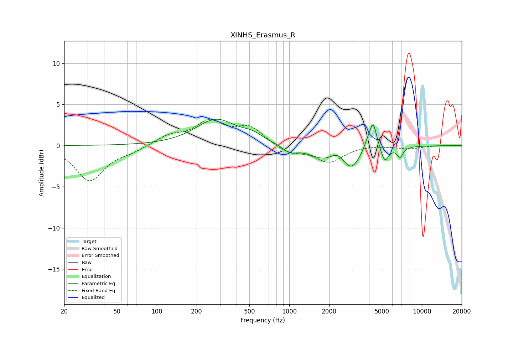

# XINHS_Erasmus_R
See [usage instructions](https://github.com/jaakkopasanen/AutoEq#usage) for more options and info.

### Parametric EQs
Apply preamp of -3.3 dB when using parametric equalizer.

|   # | Type    |   Fc (Hz) |    Q |   Gain (dB) |
|-----|---------|-----------|------|-------------|
|   1 | Peaking |       280 | 0.93 |         3.1 |
|   2 | Peaking |       527 | 1.84 |         0.8 |
|   3 | Peaking |      1010 | 2.7  |        -0.8 |
|   4 | Peaking |      1851 | 1.23 |        -1.6 |
|   5 | Peaking |      2304 | 2.5  |         1   |
|   6 | Peaking |      2935 | 2.18 |        -2.5 |
|   7 | Peaking |      3886 | 4.9  |         0.6 |
|   8 | Peaking |      4285 | 4.89 |         3.3 |
|   9 | Peaking |      5250 | 4.67 |        -1.9 |
|  10 | Peaking |      6850 | 6    |        -1.2 |

### Fixed Band EQs
When using fixed band (also called graphic) equalizer, apply preamp of **-3.3 dB** (if available) and set gains manually with these parameters.

|   # | Type    |   Fc (Hz) |    Q |   Gain (dB) |
|-----|---------|-----------|------|-------------|
|   1 | Peaking |        31 | 1.41 |        -4.2 |
|   2 | Peaking |        62 | 1.41 |        -0.6 |
|   3 | Peaking |       125 | 1.41 |         1.1 |
|   4 | Peaking |       250 | 1.41 |         2.7 |
|   5 | Peaking |       500 | 1.41 |         2.1 |
|   6 | Peaking |      1000 | 1.41 |        -0.9 |
|   7 | Peaking |      2000 | 1.41 |        -2   |
|   8 | Peaking |      4000 | 1.41 |         0.1 |
|   9 | Peaking |      8000 | 1.41 |        -0.4 |
|  10 | Peaking |     16000 | 1.41 |         0.1 |

### Graphs

