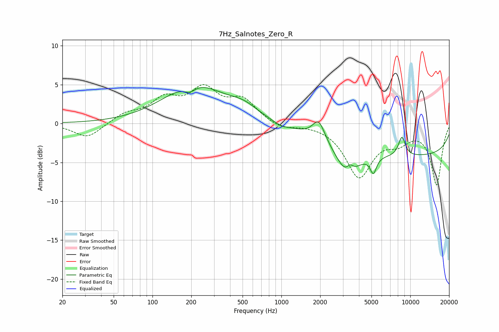

# 7Hz_Salnotes_Zero_R
See [usage instructions](https://github.com/jaakkopasanen/AutoEq#usage) for more options and info.

### Parametric EQs
Apply preamp of -4.7 dB when using parametric equalizer.

|   # | Type    |   Fc (Hz) |    Q |   Gain (dB) |
|-----|---------|-----------|------|-------------|
|   1 | Peaking |       194 | 3.05 |        -0.9 |
|   2 | Peaking |       211 | 0.6  |         4.9 |
|   3 | Peaking |       512 | 1.25 |         1.3 |
|   4 | Peaking |       997 | 2.31 |        -0.4 |
|   5 | Peaking |      1950 | 2.97 |         2.6 |
|   6 | Peaking |      3237 | 1.65 |        -3.5 |
|   7 | Peaking |      3408 | 5.99 |         0.9 |
|   8 | Peaking |      5170 | 5.88 |        -2   |
|   9 | Peaking |      8608 | 4.78 |         2.5 |
|  10 | Peaking |     10000 | 0.18 |        -4.1 |

### Fixed Band EQs
When using fixed band (also called graphic) equalizer, apply preamp of **-5.1 dB** (if available) and set gains manually with these parameters.

|   # | Type    |   Fc (Hz) |    Q |   Gain (dB) |
|-----|---------|-----------|------|-------------|
|   1 | Peaking |        31 | 1.41 |        -1.9 |
|   2 | Peaking |        62 | 1.41 |         1.2 |
|   3 | Peaking |       125 | 1.41 |         2.8 |
|   4 | Peaking |       250 | 1.41 |         4   |
|   5 | Peaking |       500 | 1.41 |         2.8 |
|   6 | Peaking |      1000 | 1.41 |        -0.7 |
|   7 | Peaking |      2000 | 1.41 |         0   |
|   8 | Peaking |      4000 | 1.41 |        -6.7 |
|   9 | Peaking |      8000 | 1.41 |        -1.8 |
|  10 | Peaking |     16000 | 1.41 |        -7.8 |

### Graphs

