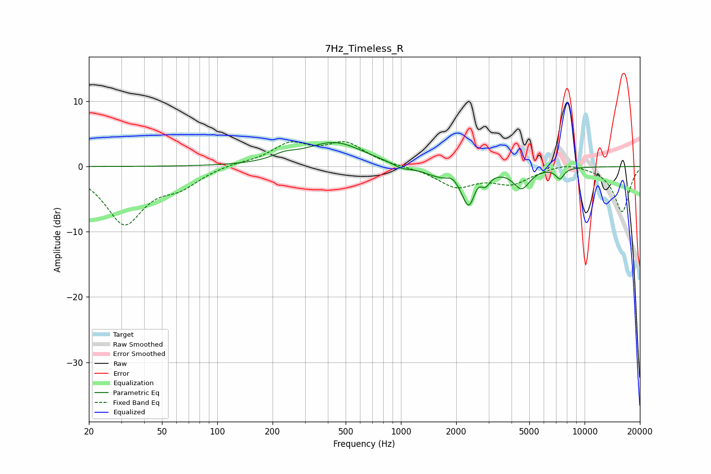

# 7Hz_Timeless_R
See [usage instructions](https://github.com/jaakkopasanen/AutoEq#usage) for more options and info.

### Parametric EQs
Apply preamp of -3.8 dB when using parametric equalizer.

|   # | Type    |   Fc (Hz) |    Q |   Gain (dB) |
|-----|---------|-----------|------|-------------|
|   1 | Peaking |       232 | 2.16 |         0.8 |
|   2 | Peaking |       435 | 0.89 |         3.7 |
|   3 | Peaking |      1007 | 3    |        -0.6 |
|   4 | Peaking |      1702 | 1.39 |        -1.6 |
|   5 | Peaking |      1907 | 4.63 |         1   |
|   6 | Peaking |      2359 | 3.63 |        -6   |
|   7 | Peaking |      2572 | 4.37 |         1.6 |
|   8 | Peaking |      2884 | 6    |        -1.5 |
|   9 | Peaking |      4539 | 3.14 |        -3.1 |
|  10 | Peaking |      7330 | 6    |        -1.6 |

### Fixed Band EQs
When using fixed band (also called graphic) equalizer, apply preamp of **-3.9 dB** (if available) and set gains manually with these parameters.

|   # | Type    |   Fc (Hz) |    Q |   Gain (dB) |
|-----|---------|-----------|------|-------------|
|   1 | Peaking |        31 | 1.41 |        -8.6 |
|   2 | Peaking |        62 | 1.41 |        -2.4 |
|   3 | Peaking |       125 | 1.41 |         0.5 |
|   4 | Peaking |       250 | 1.41 |         3.3 |
|   5 | Peaking |       500 | 1.41 |         3.3 |
|   6 | Peaking |      1000 | 1.41 |        -0   |
|   7 | Peaking |      2000 | 1.41 |        -3   |
|   8 | Peaking |      4000 | 1.41 |        -2.4 |
|   9 | Peaking |      8000 | 1.41 |         0.8 |
|  10 | Peaking |     16000 | 1.41 |        -7   |

### Graphs

