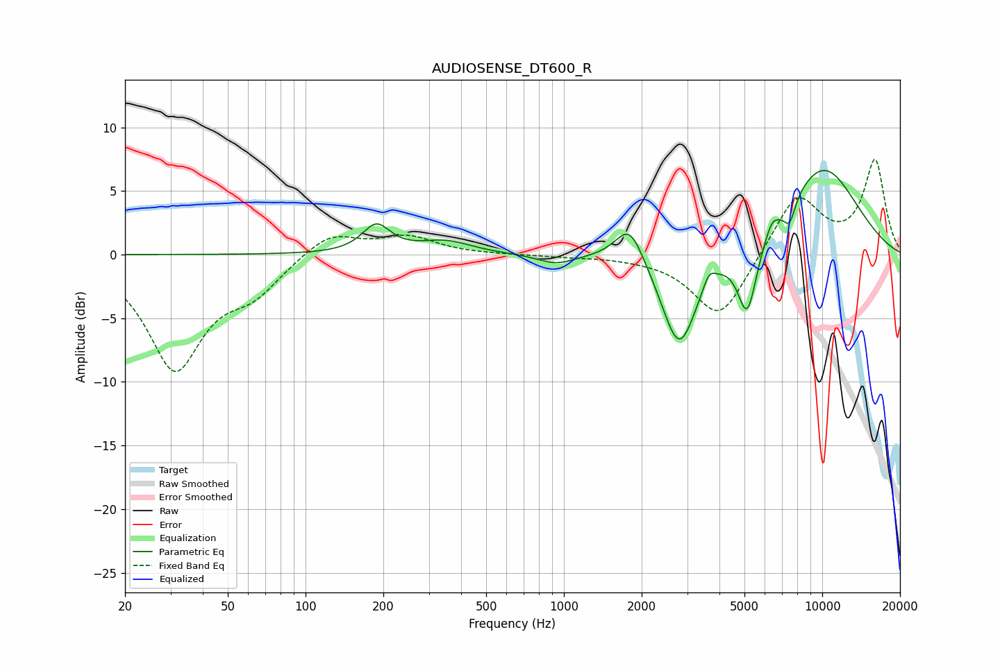

# AUDIOSENSE_DT600_R
See [usage instructions](https://github.com/jaakkopasanen/AutoEq#usage) for more options and info.

### Parametric EQs
Apply preamp of -6.7 dB when using parametric equalizer.

|   # | Type    |   Fc (Hz) |    Q |   Gain (dB) |
|-----|---------|-----------|------|-------------|
|   1 | Peaking |       188 | 2.63 |         2.2 |
|   2 | Peaking |       347 | 1.4  |         1   |
|   3 | Peaking |       931 | 1.99 |        -0.7 |
|   4 | Peaking |      1798 | 2.54 |         3.1 |
|   5 | Peaking |      2795 | 2.02 |        -7.6 |
|   6 | Peaking |      3646 | 6    |         1.1 |
|   7 | Peaking |      5126 | 3.65 |        -5.8 |
|   8 | Peaking |      6373 | 6    |         0.8 |
|   9 | Peaking |      7476 | 5.91 |        -1.8 |
|  10 | Peaking |     10000 | 0.77 |         6.9 |

### Fixed Band EQs
When using fixed band (also called graphic) equalizer, apply preamp of **-7.6 dB** (if available) and set gains manually with these parameters.

|   # | Type    |   Fc (Hz) |    Q |   Gain (dB) |
|-----|---------|-----------|------|-------------|
|   1 | Peaking |        31 | 1.41 |        -8.8 |
|   2 | Peaking |        62 | 1.41 |        -2.4 |
|   3 | Peaking |       125 | 1.41 |         1.8 |
|   4 | Peaking |       250 | 1.41 |         1.4 |
|   5 | Peaking |       500 | 1.41 |        -0   |
|   6 | Peaking |      1000 | 1.41 |        -0.1 |
|   7 | Peaking |      2000 | 1.41 |        -0.1 |
|   8 | Peaking |      4000 | 1.41 |        -5.1 |
|   9 | Peaking |      8000 | 1.41 |         4.8 |
|  10 | Peaking |     16000 | 1.41 |         7.3 |

### Graphs

