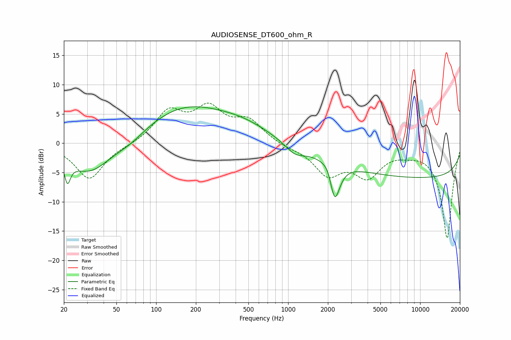

# AUDIOSENSE_DT600_ohm_R
See [usage instructions](https://github.com/jaakkopasanen/AutoEq#usage) for more options and info.

### Parametric EQs
Apply preamp of -6.3 dB when using parametric equalizer.

|   # | Type    |   Fc (Hz) |    Q |   Gain (dB) |
|-----|---------|-----------|------|-------------|
|   1 | Peaking |        21 | 5.33 |         2.4 |
|   2 | Peaking |        21 | 5.87 |        -6   |
|   3 | Peaking |        31 | 0.85 |        -5.3 |
|   4 | Peaking |        64 | 1.2  |        -1.3 |
|   5 | Peaking |       164 | 0.44 |         6   |
|   6 | Peaking |       467 | 0.66 |         2   |
|   7 | Peaking |      1126 | 1.89 |        -1.7 |
|   8 | Peaking |      2056 | 3.33 |         2.2 |
|   9 | Peaking |      2242 | 3.52 |        -7.7 |
|  10 | Peaking |     10000 | 0.18 |        -5.8 |

### Fixed Band EQs
When using fixed band (also called graphic) equalizer, apply preamp of **-7.0 dB** (if available) and set gains manually with these parameters.

|   # | Type    |   Fc (Hz) |    Q |   Gain (dB) |
|-----|---------|-----------|------|-------------|
|   1 | Peaking |        31 | 1.41 |        -6.1 |
|   2 | Peaking |        62 | 1.41 |        -0.3 |
|   3 | Peaking |       125 | 1.41 |         5.1 |
|   4 | Peaking |       250 | 1.41 |         5.4 |
|   5 | Peaking |       500 | 1.41 |         3.6 |
|   6 | Peaking |      1000 | 1.41 |        -0.6 |
|   7 | Peaking |      2000 | 1.41 |        -5   |
|   8 | Peaking |      4000 | 1.41 |        -5   |
|   9 | Peaking |      8000 | 1.41 |        -0.8 |
|  10 | Peaking |     16000 | 1.41 |       -16.2 |

### Graphs

