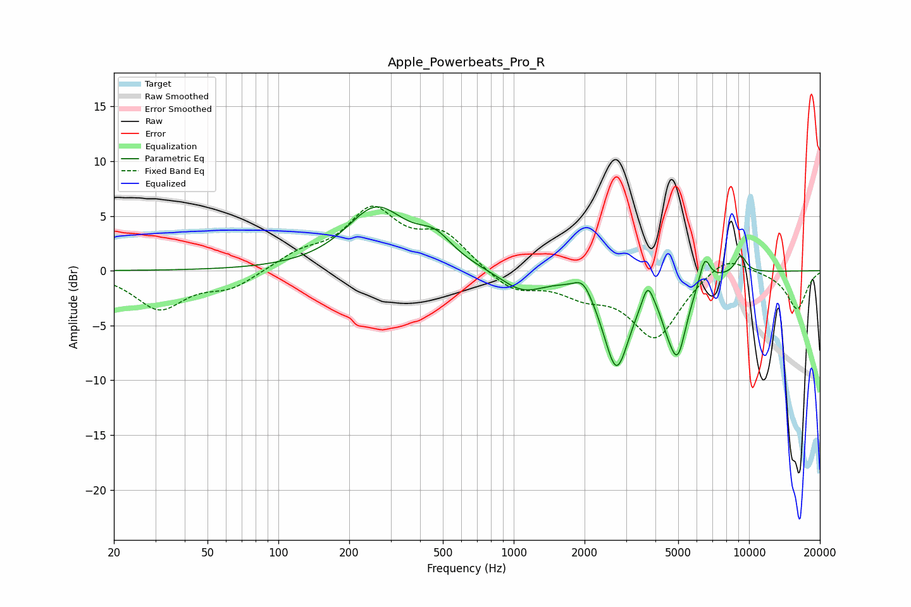

# Apple_Powerbeats_Pro_R
See [usage instructions](https://github.com/jaakkopasanen/AutoEq#usage) for more options and info.

### Parametric EQs
Apply preamp of -5.9 dB when using parametric equalizer.

|   # | Type    |   Fc (Hz) |    Q |   Gain (dB) |
|-----|---------|-----------|------|-------------|
|   1 | Peaking |       260 | 1.11 |         5.5 |
|   2 | Peaking |       463 | 1.85 |         2.1 |
|   3 | Peaking |      1089 | 1.51 |        -1.8 |
|   4 | Peaking |      1975 | 3.76 |         1.4 |
|   5 | Peaking |      2733 | 2.48 |        -8.5 |
|   6 | Peaking |      3709 | 5.97 |         2.1 |
|   7 | Peaking |      4463 | 5.54 |        -0.9 |
|   8 | Peaking |      4960 | 3.4  |        -6.9 |
|   9 | Peaking |      6480 | 5.96 |         2.5 |
|  10 | Peaking |      9217 | 5.24 |         1.6 |

### Fixed Band EQs
When using fixed band (also called graphic) equalizer, apply preamp of **-6.0 dB** (if available) and set gains manually with these parameters.

|   # | Type    |   Fc (Hz) |    Q |   Gain (dB) |
|-----|---------|-----------|------|-------------|
|   1 | Peaking |        31 | 1.41 |        -3.4 |
|   2 | Peaking |        62 | 1.41 |        -1.5 |
|   3 | Peaking |       125 | 1.41 |         1.4 |
|   4 | Peaking |       250 | 1.41 |         5.2 |
|   5 | Peaking |       500 | 1.41 |         3.1 |
|   6 | Peaking |      1000 | 1.41 |        -1.9 |
|   7 | Peaking |      2000 | 1.41 |        -1.7 |
|   8 | Peaking |      4000 | 1.41 |        -6   |
|   9 | Peaking |      8000 | 1.41 |         1.7 |
|  10 | Peaking |     16000 | 1.41 |        -3.5 |

### Graphs

