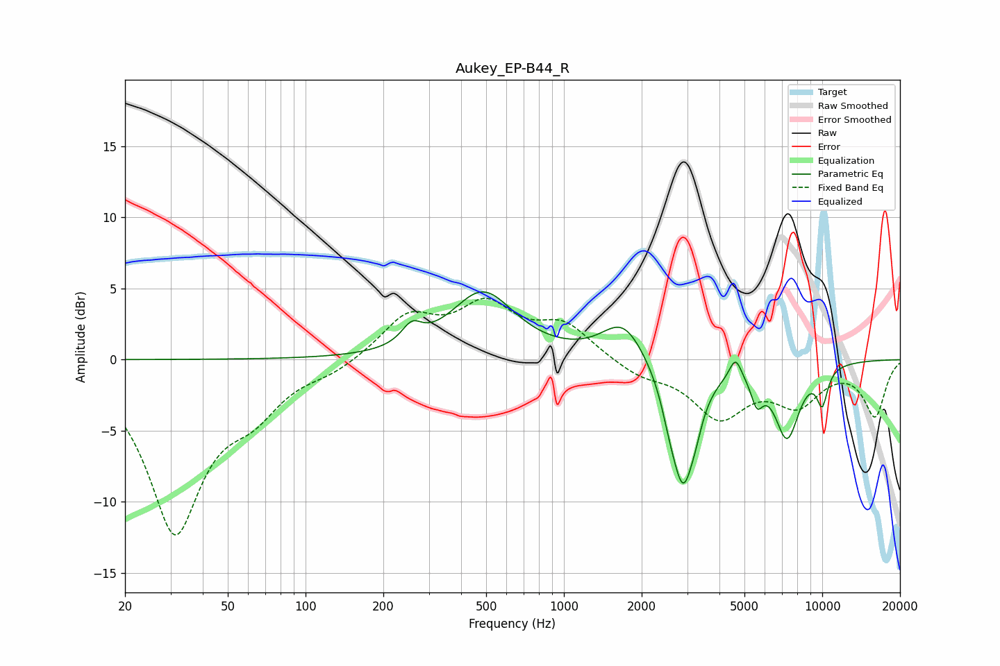

# Aukey_EP-B44_R
See [usage instructions](https://github.com/jaakkopasanen/AutoEq#usage) for more options and info.

### Parametric EQs
Apply preamp of -4.9 dB when using parametric equalizer.

|   # | Type    |   Fc (Hz) |    Q |   Gain (dB) |
|-----|---------|-----------|------|-------------|
|   1 | Peaking |       258 | 3.67 |         1.3 |
|   2 | Peaking |       485 | 1.16 |         4.7 |
|   3 | Peaking |      1699 | 1.72 |         2.8 |
|   4 | Peaking |      2550 | 5    |        -1.1 |
|   5 | Peaking |      2894 | 2.91 |        -8.6 |
|   6 | Peaking |      3250 | 6    |        -0.7 |
|   7 | Peaking |      4616 | 6    |         1.5 |
|   8 | Peaking |      5588 | 5.92 |        -1.9 |
|   9 | Peaking |      7306 | 2.74 |        -5.2 |
|  10 | Peaking |     10000 | 5.77 |        -2.4 |

### Fixed Band EQs
When using fixed band (also called graphic) equalizer, apply preamp of **-4.4 dB** (if available) and set gains manually with these parameters.

|   # | Type    |   Fc (Hz) |    Q |   Gain (dB) |
|-----|---------|-----------|------|-------------|
|   1 | Peaking |        31 | 1.41 |       -11.9 |
|   2 | Peaking |        62 | 1.41 |        -2.6 |
|   3 | Peaking |       125 | 1.41 |        -0.7 |
|   4 | Peaking |       250 | 1.41 |         2.9 |
|   5 | Peaking |       500 | 1.41 |         3.5 |
|   6 | Peaking |      1000 | 1.41 |         2.3 |
|   7 | Peaking |      2000 | 1.41 |        -1   |
|   8 | Peaking |      4000 | 1.41 |        -3.8 |
|   9 | Peaking |      8000 | 1.41 |        -2.8 |
|  10 | Peaking |     16000 | 1.41 |        -3.9 |

### Graphs

